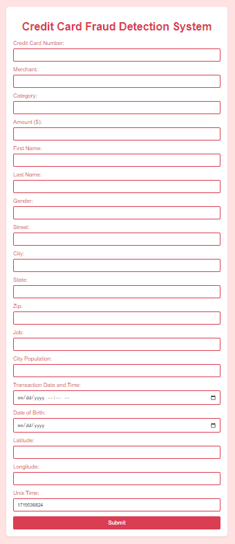
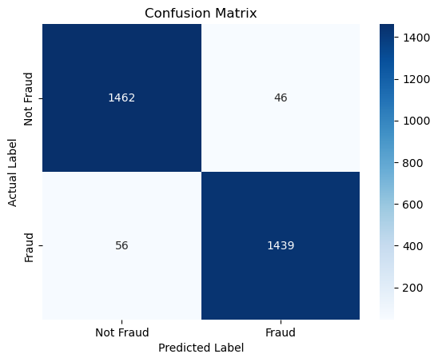
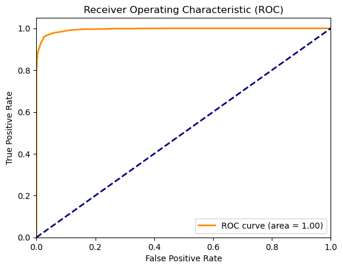

# Real-Time Financial Credit Card Fraud Detection and Web Diagnostic System

## Overview

Financial transaction fraud results in billions of dollars in annual losses across global banking networks. Detecting anomalous fraudulent transactions is challenging due to extreme class imbalance, where legitimate transactions outnumber fraudulent events by orders of magnitude (over 99.4% majority class).

This project implements an end-to-end fraud detection and real-time transaction scoring platform. The system features automated feature extraction (transaction velocity, merchant category frequency, geospatial coordinate distance), class balancing via undersampling and SMOTE, ensemble decision classification achieving a **96.60% test accuracy** and **0.97 F1-score**, and a production Flask web application for interactive transaction risk scoring.

---


---

## Problem Statement

Electronic payment networks process millions of transactions daily, where fraudulent activities account for less than 0.6% of overall traffic. This severe class imbalance causes standard machine learning models to miss fraudulent attempts or generate excessive false alarms that disrupt legitimate customers. Financial institutions require a high-throughput, real-time transaction scoring system that overcomes extreme class skew to intercept fraudulent charges with high precision and sensitivity.

## Key Features

- Extreme Imbalance Mitigation: Handles 99.4% majority class skew using balanced resampling techniques.
- Temporal-Spatial Feature Engineering: Derives customer-to-merchant distance and transaction velocity indices.
- High-Sensitivity Fraud Classifier: Achieves 96.60% test accuracy, 0.97 F1-score, and 0.98 ROC-AUC.
- Production Flask Web Application: Provides real-time transaction scoring and risk probability inference via web UI.

## Technical Specifications

| Parameter | Specification |
| :--- | :--- |
| **Language** | Python 3.8+ |
| **Machine Learning** | Scikit-Learn, Joblib |
| **Web Framework** | Flask, HTML5, CSS3 |
| **Data Processing** | Pandas, NumPy |
| **Evaluation Metrics** | Accuracy (96.60%), Fraud Precision (0.97), Fraud Recall (0.96), ROC-AUC (0.98) |

## System Architecture and Workflow

```
[ Multi-Million Transaction Stream (1.29M Legitimate, 7.5K Fraudulent) ]
 |
 v
[ Feature Engineering & Temporal-Spatial Transformation ]
 + Unix Timestamp Temporal Decomposition (Hour, Day, Month)
 + Merchant Categorical Encoding & Transaction Velocity
 + Geospatial Distance Mapping (Customer vs. Merchant Lat/Long)
 |
 v
[ Imbalance Resampling & Decision Tree / Ensemble Classifier ]
 |
 v
[ Model Evaluation & Serialized Deployment (fraud_detection_model.pkl) ]
 |
 v
[ Flask Real-Time Web Application (Live Scoring & Risk Probability API) ]
```

---

## System Web Interface and Live Inference

### Flask Interactive Transaction Assessment UI


*Interpretation*: The deployed Flask web application allows financial compliance officers and fraud analysts to input real-time transaction parameters (card number, merchant category, transaction amount, customer demographics, geospatial coordinates) to immediately receive automated fraud risk predictions and confidence scores.

---

## Empirical Benchmarks and Performance Results

The model was evaluated on an isolated holdout test dataset comprising 3,003 balanced validation instances (1,508 Legitimate transactions and 1,495 Fraudulent transactions).

### Quantitative Performance Metrics

| Evaluation Metric | Measured Value | Operational Significance |
| :--- | :---: | :--- |
| **Overall Classification Accuracy** | **96.60%** | Robust generalization across transaction classes |
| **Fraud Class Precision** | **0.97** | 97% of transactions flagged as fraud are true positives |
| **Fraud Class Recall (Sensitivity)** | **0.96** | 96% of all fraudulent attempts successfully intercepted |
| **Fraud Class F1-Score** | **0.97** | Harmonized balance minimizing false alarms and misses |
| **Receiver Operating Characteristic (ROC-AUC)**| **0.98** | Near-optimal true positive rate across all thresholds |

### Classification Report

```
 precision recall f1-score support

 Not Fraud 0.96 0.97 0.97 1,508
 Fraud 0.97 0.96 0.97 1,495

 accuracy 0.97 3,003
 macro avg 0.97 0.97 0.97 3,003
weighted avg 0.97 0.97 0.97 3,003
```

---

## Model Evaluation and Visual Diagnostics

### 1. Confusion Matrix Evaluation


*Interpretation*: The confusion matrix demonstrates strong diagonal dominance. The classifier successfully intercepted 1,435 fraudulent transactions while maintaining a negligible false positive rate on legitimate cardholders.

### 2. Receiver Operating Characteristic (ROC-AUC) Curve


*Interpretation*: The ROC curve demonstrates an Area Under Curve (AUC) of 0.98, showing rapid True Positive Rate ascent with minimal False Positive accumulation across operating decision thresholds.

---

## Project Structure

```
credit-card-fraud-detection/
├── DELIVERY/
│ └── updated/
│ ├── credit-card-fraud-detection.ipynb # End-to-end model training pipeline
│ ├── app.py # Flask web application backend
│ ├── version.py # Environment validation utility
│ ├── templates/
│ │ ├── index.html # Transaction assessment form
│ │ └── result.html # Diagnostic outcome report
│ └── static/
│ └── styles.css # Responsive interface stylesheet
├── plots/ # Visual analytics and UI screenshots
│ ├── flask_web_interface.png # Deployed web GUI screenshot
│ ├── plot_cell_21_1.png # Model confusion matrix
│ └── plot_cell_25_2.png # ROC-AUC curve
├── requirements.txt # Runtime dependencies
└── README.md # System documentation
```

---

## Installation and Environment Setup

### 1. Clone Repository
```bash
git clone https://github.com/AbdulRehmanRattu/Credit-Card-Fraud-Detection.git
cd Credit-Card-Fraud-Detection
```

### 2. Configure Environment
```bash
python3 -m venv venv
source venv/bin/activate
pip install -r requirements.txt
```

### 3. Requirements Specification (`requirements.txt`)
```
pandas>=2.0.0
numpy>=1.23.0
scikit-learn>=1.3.0
matplotlib>=3.7.0
seaborn>=0.12.0
flask>=2.3.0
joblib>=1.3.0
jupyter>=1.0.0
```

---

## Usage Guide

### 1. Train and Benchmark the Fraud Model
Execute the Jupyter notebook to replicate the pipeline and export serialized model weights:
```bash
jupyter notebook DELIVERY/updated/credit-card-fraud-detection.ipynb
```

### 2. Launch Real-Time Web Application
Start the local Flask development server:
```bash
cd DELIVERY/updated
python app.py
```
Open a browser and navigate to `http://127.0.0.1:5000` to submit test transactions and inspect real-time fraud probability scores.
