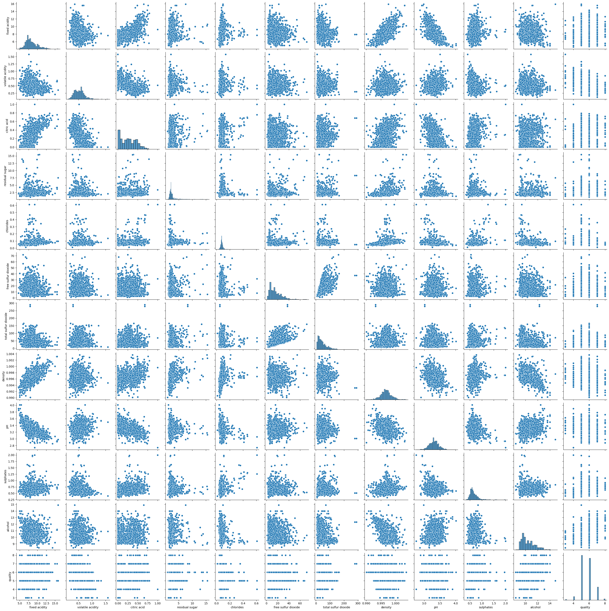
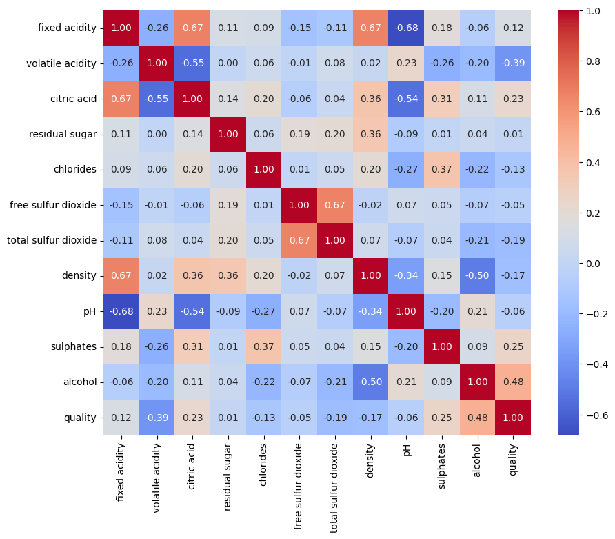
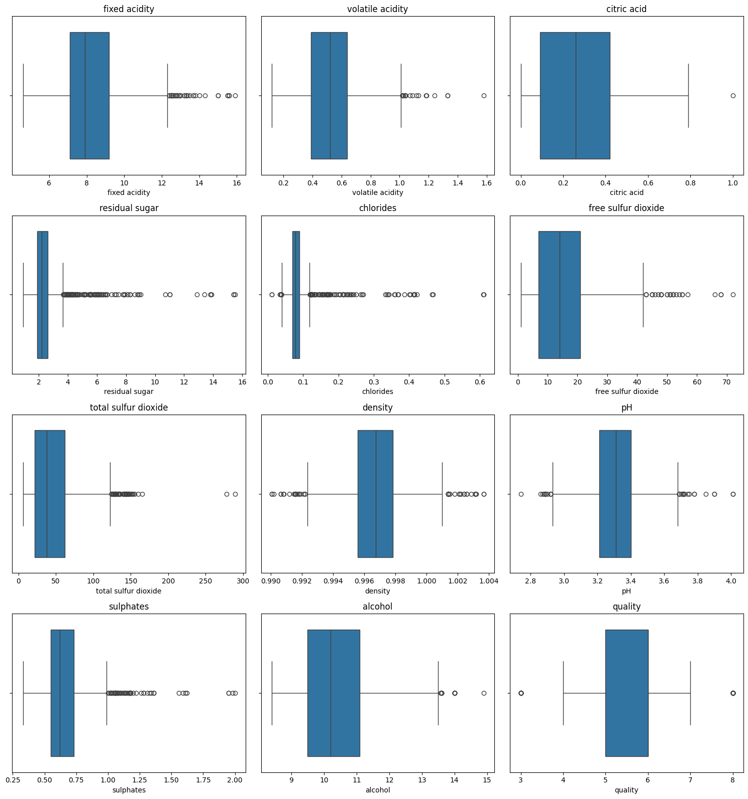
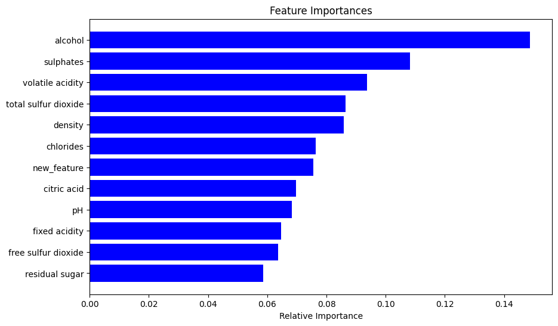
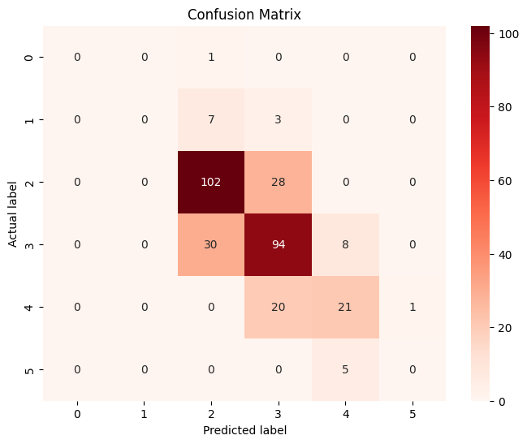
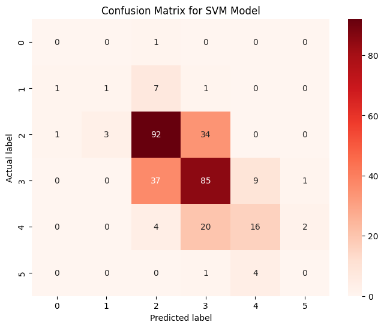
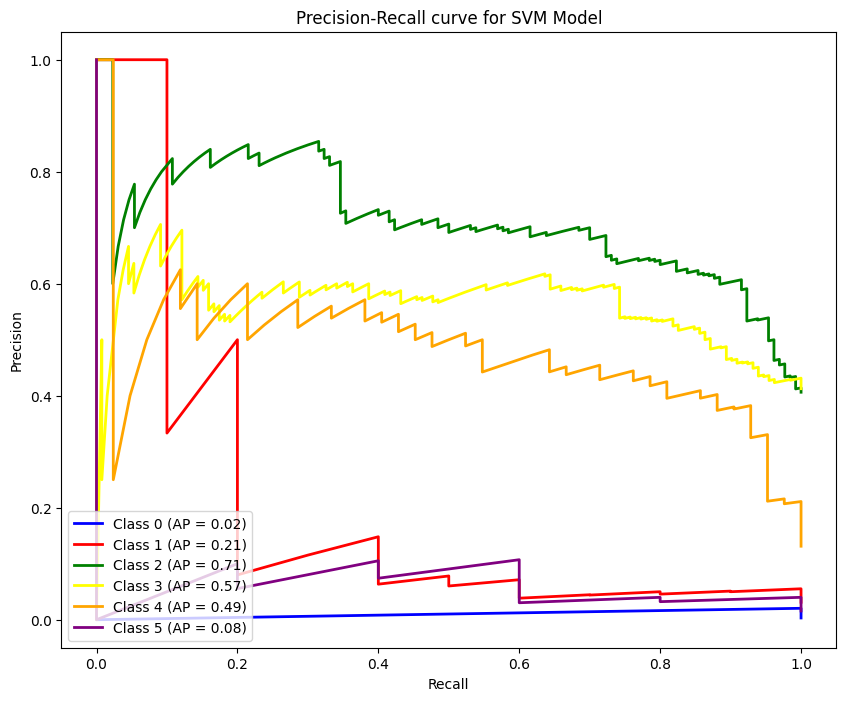

# Red Wine Quality Classification and Physicochemical Analysis

## Overview

Wine quality evaluation traditionally relies on sensory testing by human sommeliers, a process susceptible to subjective variability and high operational costs.

This project develops an end-to-end predictive machine learning framework to evaluate and classify red wine quality based strictly on objective physicochemical properties. By implementing exploratory data analysis, outlier quantification, feature engineering, class re-balancing techniques, and systematic hyperparameter optimization across ensemble and kernel-based algorithms, the pipeline models non-linear chemical interactions and provides granular feature importance insights for viticulture and quality assurance.

---


---

## Problem Statement

Traditional wine quality evaluation depends heavily on human sensory tasting by certified sommeliers, which introduces subjective bias, human fatigue, and high operational costs. Wineries and distributors require an automated, objective quality assurance framework that can accurately predict sensory quality grades directly from measurable physicochemical properties (such as volatile acidity, alcohol content, residual sugar, and sulfur dioxide levels) during fermentation and bottling.

## Key Features

- Multi-Class Physicochemical Modeling: Predicts discrete wine quality ratings (scores 3 to 8) from 11 chemical properties.
- Exploratory Outlier Profiling: Quantifies outlier distributions across volatile acidity, residual sugars, and chlorides using IQR methods.
- Class Imbalance Mitigation: Benchmarks balanced class weighting against standard cost functions.
- Hyperparameter Grid Optimization: Systematic 3-fold cross-validation tuning for Random Forest and Support Vector Classifiers.

## Technical Specifications

| Parameter | Specification |
| :--- | :--- |
| **Language** | Python 3.8+ |
| **Machine Learning** | Scikit-Learn (Random Forest, SVC, GridSearchCV) |
| **Data Processing** | Pandas, NumPy |
| **Visual Analytics** | Matplotlib, Seaborn |
| **Metric Framework** | Precision, Recall, Macro F1, Precision-Recall Curves |

## System Architecture and Workflow

The analytical pipeline is structured into four core phases:

```
[ Physicochemical Dataset (1,599 Samples, 11 Chemical Properties) ]
 |
 v
[ Exploratory Data Analysis & Outlier Detection ]
 + Bivariate Pairplots & Pearson Correlation Heatmaps
 + Interquartile Range (IQR) Boxplot Distributions
 |
 v
[ Feature Engineering & Interaction Modeling ]
 + Combined Volatile Acidity / Alcohol Impact Factor
 + Total Sulfur / Free Sulfur Dynamics
 |
 v
[ Model Benchmarking & Multi-Class Classification ]
 + Random Forest Classifier (Baseline, Class-Weighted, GridSearch Refined)
 + Support Vector Classifier (RBF Kernel, Cost Optimization)
 |
 v
[ Evaluation, Confusion Matrix Analysis & Precision-Recall Profiling ]
```

---

## Dataset Description

The dataset comprises 1,599 red wine samples evaluated across 11 physicochemical attributes and graded on a discrete quality score scale (ranging from 3 to 8).

| Feature Name | Description | Units |
| :--- | :--- | :--- |
| **Fixed Acidity** | Non-volatile acids contributing to taste | g(tartaric acid)/dm³ |
| **Volatile Acidity** | High levels lead to unpleasant vinegar taste | g(acetic acid)/dm³ |
| **Citric Acid** | Adds freshness and flavor profile | g/dm³ |
| **Residual Sugar** | Residual sugar content post-fermentation | g/dm³ |
| **Chlorides** | Concentration of mineral salts | g(sodium chloride)/dm³ |
| **Free Sulfur Dioxide** | Prevents microbial growth and oxidation | mg/dm³ |
| **Total Sulfur Dioxide** | Bound + Free SO2 concentration | mg/dm³ |
| **Density** | Mass density relative to water | g/cm³ |
| **pH** | Level of acidity on a 0 to 14 scale | pH Units |
| **Sulphates** | Antimicrobial and antioxidant additive | g(potassium sulphate)/dm³ |
| **Alcohol** | Percent alcohol content by volume | % vol |
| **Quality (Target)** | Sensory evaluation rating | Integer (3 to 8) |

---

## Exploratory Data Analysis and Feature Visualizations

### 1. Bivariate Pairplot Analysis


*Interpretation*: The pairplot illustrates the feature distributions and pairwise scatter relationships across all 11 chemical attributes. Notable non-linear separations exist between alcohol concentration and volatile acidity across quality ratings.

### 2. Pearson Feature Correlation Heatmap


*Interpretation*: The correlation matrix reveals key dependencies:
- **Alcohol Content** exhibits the strongest positive linear correlation (+0.48) with wine quality.
- **Volatile Acidity** displays a strong negative correlation (-0.39) with wine quality, confirming that elevated acetic acid degrades sensory appeal.
- **Citric Acid** and **Fixed Acidity** correlate positively (+0.67), while **Fixed Acidity** and **pH** exhibit a strong inverse relationship (-0.68).

### 3. Outlier Quantification via Boxplot Distributions


*Interpretation*: Subplot boxplots display the distribution and Interquartile Range (IQR) for all attributes. Significant positive outliers are present in `residual sugar`, `chlorides`, and `total sulfur dioxide`, which were isolated during preprocessing to prevent distortion in distance-based estimators.

---

## Empirical Benchmarks and Performance Results

All models were evaluated on an isolated 20% test partition (320 test instances) with stratified sampling.

### Comparative Model Performance Table

| Model Architecture | Configuration / Optimization | Test Accuracy | Macro F1-Score | Weighted F1-Score |
| :--- | :--- | :---: | :---: | :---: |
| **Random Forest (Tuned + FE)** | `n_estimators: 480`, `max_depth: 25`, `min_samples_split: 3` | **67.81%** | **0.42** | **0.67** |
| **Random Forest (Weighted)** | Balanced Class Weights | 67.50% | 0.41 | 0.67 |
| **Random Forest (Baseline)** | Default Hyperparameters | 65.94% | 0.39 | 0.65 |
| **Support Vector Classifier (Tuned)** | `C: 10`, `gamma: 'scale'`, `kernel: 'rbf'` | 60.63% | 0.36 | 0.59 |
| **Support Vector Classifier (Baseline)** | Default RBF Kernel | 58.44% | 0.35 | 0.57 |
| **Support Vector Classifier (Weighted)** | Balanced Class Weights | 47.81% | 0.34 | 0.48 |

---

## Model Evaluation and Visual Diagnostics

### 1. Random Forest Feature Importance Attribution


*Interpretation*: Gini impurity reduction ranking identifies `alcohol`, `total sulfur dioxide`, `volatile acidity`, and `sulphates` as the top four dominant predictive factors, collectively accounting for over 50% of the ensemble decision tree splits.

### 2. Random Forest Confusion Matrix


*Interpretation*: The confusion matrix shows strong diagonal concentration for the dominant quality classes 5 and 6. The model achieves high precision on mid-tier wines while demonstrating low false-positive rates on boundary classes.

### 3. Support Vector Classifier (SVM) Confusion Matrix


*Interpretation*: The tuned SVM classifier exhibits consistent diagonal predictions for modal quality classes, with errors confined strictly to immediately adjacent rating categories.

### 4. Precision-Recall Curves (Multi-Class SVM)


*Interpretation*: One-vs-Rest Precision-Recall curves demonstrate high Average Precision (AP) across quality score thresholds, illustrating the classifier's trade-off between sensitivity and specificity under class imbalance.

---

## Project Structure

```
red-wine-quality-prediction/
├── project.ipynb # Complete EDA, preprocessing, and model benchmarking
├── winequality-red.csv # Physicochemical dataset
├── plots/ # Generated plots and visualization assets
│ ├── plot_cell_6_1.png # Pairplot scatter matrix
│ ├── plot_cell_6_2.png # Pearson correlation heatmap
│ ├── plot_cell_6_3.png # Boxplot outlier distributions
│ ├── plot_cell_19_4.png # Random Forest feature importance
│ ├── plot_cell_20_6.png # Random Forest confusion matrix
│ ├── plot_cell_30_7.png # SVM confusion matrix
│ └── plot_cell_30_8.png # SVM precision-recall curves
├── requirements.txt # Runtime dependencies
└── README.md # Technical documentation
```

---

## Installation and Environment Setup

### 1. Clone Repository
```bash
git clone https://github.com/AbdulRehmanRattu/Red_Wine_Quality_Prediction.git
cd Red_Wine_Quality_Prediction
```

### 2. Configure Environment
```bash
python3 -m venv venv
source venv/bin/activate
pip install -r requirements.txt
```

### 3. Requirements Specification (`requirements.txt`)
```
pandas>=2.0.0
numpy>=1.23.0
scikit-learn>=1.3.0
matplotlib>=3.7.0
seaborn>=0.12.0
jupyter>=1.0.0
```

---

## Usage Guide

Launch Jupyter Notebook to inspect the analysis and execute training cells:
```bash
jupyter notebook project.ipynb
```
