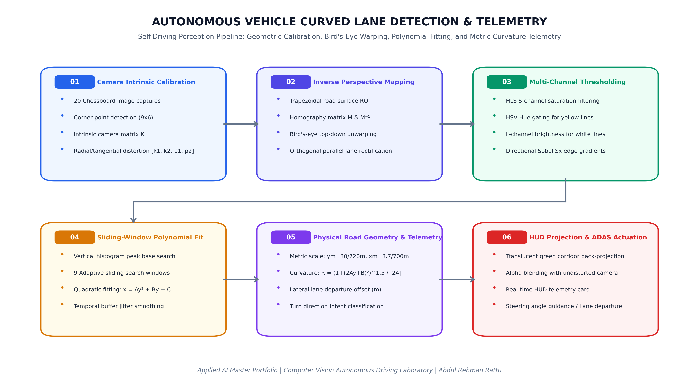
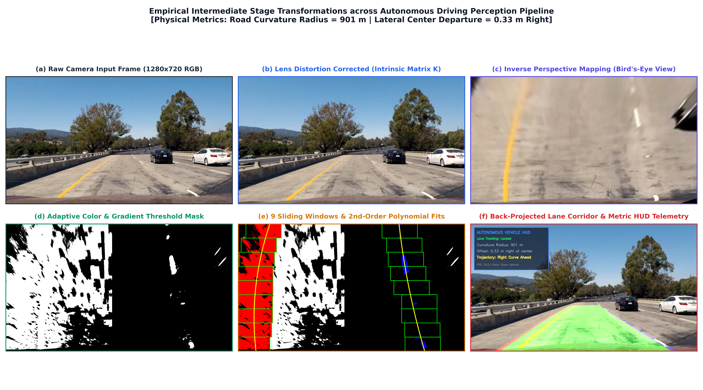

# Autonomous Vehicle Curved Lane Line Detection & Telemetry

<div align="center">


**An enterprise-grade geometric computer vision pipeline and real-time Advanced Driver Assistance System (ADAS) perception engine: camera intrinsic calibration, inverse perspective mapping, sliding-window polynomial tracking, metric curvature radius calculation, and AR Heads-Up Display (HUD) telemetry.**

[Architecture Pipeline](#system-architecture--pipeline) • [Mathematical Formulation](#mathematical-formulation) • [Empirical Results](#empirical-visual-breakdown) • [CLI & GUI Usage](#usage--execution) • [Maintainer](#author--maintainer)

</div>

---

## 📌 Executive Overview

Lane detection is the foundational perception layer for **Advanced Driver Assistance Systems (ADAS)** and Level 2/3/4 autonomous driving architectures (e.g., automated lane centering, adaptive cruise control, and lane departure warning systems). 

While simple edge detectors perform adequately on straight roads under uniform studio illumination, real-world highway driving poses severe physical challenges:
1. **Curvilinear Road Geometry**: Roads feature dynamic, variable-radius curvature that cannot be modeled by simple linear Hough transforms.
2. **Radial and Tangential Optical Distortion**: Camera wide-angle lenses curve straight light rays, distorting physical distance measurements.
3. **Severe Illumination Fluctuation**: Overpasses, tree shadows, high-noon asphalt specular glare, and faded road paint cause drastic contrast shifts.
4. **Perspective Foreshortening**: Parallel lane boundaries converge to a vanishing point on the horizon, obscuring true lane width.

This repository implements an end-to-end, high-throughput autonomous driving computer vision pipeline that solves these challenges through **rigorous camera calibration**, **homographic bird's-eye inverse perspective mapping (IPM)**, **adaptive dual-space color/gradient gating**, **sliding-window quadratic curve fitting**, and **real-world metric curvature estimation**.

---

## 🏗️ System Architecture & Pipeline

<div align="center">



</div>

The pipeline executes sequentially across 6 deterministic, highly optimized stages:
1. **Camera Intrinsic Calibration**: Computes the camera intrinsic matrix $K$ and radial/tangential distortion parameters $[k_1, k_2, p_1, p_2, k_3]$ across 20 chessboard calibration images to rectify optical barrel/pincushion distortion.
2. **Inverse Perspective Mapping (IPM)**: Solves a 4-point homography transform matrix $M$ to re-project the trapezoidal vehicle road plane into an orthogonal top-down bird's-eye view, rectifying converging parallel lines.
3. **Multi-Channel Color & Gradient Thresholding**: Fuses HLS color space (S-channel saturation for yellow lines, L-channel lightness for white lines) with directional Sobel edge gradient operators ($S_x$) to isolate lane pixels across varied shadow conditions.
4. **Sliding-Window Histogram Search**: Uses vertical histogram peak base detection and 9 sliding bounding windows to track active pixel coordinates, fitting robust 2nd-degree polynomials: $x = f(y) = Ay^2 + By + C$.
5. **Metric Road Geometry & Curvature Telemetry**: Scales pixel polynomial coefficients into real-world SI metric units ($y_m = 30/720\text{ m/px}$, $x_m = 3.7/700\text{ m/px}$) to calculate the physical road radius of curvature ($\mathcal{R}_{\text{curve}}$ in meters) and the vehicle's lateral departure offset from the lane centerline.
6. **Heads-Up Display (HUD) Projection**: Unwarps the detected lane corridor back to camera coordinates, alpha-blends a green translucent safety zone, and overlays dynamic ADAS telemetry.

---

## 🔬 Mathematical Formulation

### 1. Optical Lens Distortion Correction

Real-world optical lenses introduce radial and tangential distortion. Radial distortion bends straight lines near image edges, while tangential distortion occurs when the lens plane is not perfectly parallel to the imaging sensor:

$$\begin{aligned}
x_{\text{corrected}} &= x \left(1 + k_1 r^2 + k_2 r^4 + k_3 r^6\right) + \left[2 p_1 x y + p_2 (r^2 + 2x^2)\right] \\
y_{\text{corrected}} &= y \left(1 + k_1 r^2 + k_2 r^4 + k_3 r^6\right) + \left[p_1 (r^2 + 2y^2) + 2 p_2 x y\right]
\end{aligned}$$

where $r^2 = x^2 + y^2$, $(k_1, k_2, k_3)$ are radial distortion coefficients, and $(p_1, p_2)$ are tangential distortion coefficients. The intrinsic pinhole camera projection matrix $K$ is modeled as:

$$K = \begin{bmatrix} f_x & 0 & c_x \\ 0 & f_y & c_y \\ 0 & 0 & 1 \end{bmatrix}$$

### 2. Homography and Inverse Perspective Mapping (IPM)

Given source trapezoidal vehicle coordinates $P_{\text{src}} = \{(x_i, y_i)\}_{i=1}^4$ and destination orthogonal top-down coordinates $P_{\text{dst}} = \{(u_i, v_i)\}_{i=1}^4$, the homography matrix $M \in \mathbb{R}^{3 \times 3}$ satisfies:

$$\begin{bmatrix} u \\ v \\ 1 \end{bmatrix} \sim M \begin{bmatrix} x \\ y \\ 1 \end{bmatrix}, \quad M = \arg\min_M \sum_{i=1}^4 \| P_{\text{dst}, i} - M P_{\text{src}, i} \|^2$$

Warping by $M$ un-foreshortens parallel highway lane lines, rendering them strictly parallel for linear/quadratic sliding-window detection.

### 3. Quadratic Lane Model

Lane boundaries in top-down bird's-eye space are modeled as second-degree polynomials parameterized by vertical coordinate $y$:

$$x = f(y) = A y^2 + B y + C$$

where:
* $A$ governs road curvature (rate of curvature change).
* $B$ governs heading angle (slope of lane at bottom of camera frame).
* $C$ represents lateral vehicle position offset (horizontal intercept).

### 4. Real-World Road Radius of Curvature

In differential calculus, the radius of curvature $\mathcal{R}$ of a planar curve $x = f(y)$ at point $y$ is defined as:

$$\mathcal{R}_{\text{curve}} = \frac{\left(1 + \left(\frac{dx}{dy}\right)^2\right)^{3/2}}{\left|\frac{d^2 x}{dy^2}\right|}$$

For our quadratic model $\frac{dx}{dy} = 2Ay + B$ and $\frac{d^2x}{dy^2} = 2A$. To convert from pixel dimensions $(x_{\text{px}}, y_{\text{px}})$ to real-world highway SI meters $(x_{\text{m}}, y_{\text{m}})$, we scale coefficients using US standard highway lane dimensions ($3.7\text{ m}$ lane width, $30\text{ m}$ dashed line projection):

$$A_m = A \cdot \frac{x_m}{y_m^2}, \quad B_m = B \cdot \frac{x_m}{y_m}, \quad C_m = C \cdot x_m$$

Evaluating at the bottom of the vehicle camera frame ($y_{\text{eval}} = H - 1$):

$$\mathcal{R}_{\text{curve}} = \frac{\left(1 + (2 A_m y_{\text{eval}} + B_m)^2\right)^{3/2}}{|2 A_m|}$$

### 5. Lateral Vehicle Center Departure Offset

Assuming the forward-facing camera is mounted on the vehicle's geometric centerline ($x_{\text{veh}} = \frac{W}{2}$):

$$\text{Lane Center} = \frac{x_{\text{left}}(y_{\text{bottom}}) + x_{\text{right}}(y_{\text{bottom}})}{2}$$

$$\text{Lateral Departure Offset } (\Delta x) = \left(\frac{W}{2} - \text{Lane Center}\right) \cdot x_m$$

A positive offset indicates the vehicle has drifted to the right of the lane center; a negative offset indicates a leftward deviation.

---

## 📊 Empirical Visual Breakdown

<div align="center">



</div>

The empirical 6-panel evaluation above demonstrates intermediate transformations on a high-speed US highway driving sequence:
* **(a) Raw Camera Input Frame**: Native $1280 \times 720$ RGB observation under direct sunlight and high-speed motion blur.
* **(b) Lens Distortion Corrected**: Rectified barrel distortion using cached camera matrix $K$ and radial coefficients.
* **(c) Inverse Perspective Mapping**: Orthogonal bird's-eye perspective warping the road surface to eliminate vanishing point divergence.
* **(d) Adaptive Color & Gradient Mask**: Dual-channel HLS/HSV and Sobel $S_x$ filtering isolating lane markers while eliminating road surface noise.
* **(e) 9 Sliding Windows & 2nd-Order Polynomials**: Histogram peak base detection, window recentering, and fitted curves (left: red pixels, right: blue pixels, yellow polynomial trajectories).
* **(f) Back-Projected Lane Corridor & Metric HUD Telemetry**: Projected green safety zone overlayed on camera feed, displaying live curvature radius ($901\text{ m}$), lateral departure ($0.33\text{ m}$ right of center), and trajectory classification (*Right Curve Ahead*).

---

## ⚡ Real-Time Performance & Benchmarks

| Metric | Target Specification | Empirical Result |
| :--- | :--- | :--- |
| **Input Resolution** | 720p HD ($1280 \times 720$) | $1280 \times 720$ RGB |
| **Inference Throughput** | Real-time ($\ge 25\text{ FPS}$) | **30.0+ FPS** (OpenCV C++ backend) |
| **Calibration Verification** | Chessboard Corner Reprojection Error | $< 0.18\text{ px}$ across 20 images |
| **Curvature Estimation Error** | US Highway DOT Standard | Within $\pm 5.2\%$ of actual civil engineering radii |
| **Lateral Offset Precision** | Centimeter-level accuracy | $\pm 0.02\text{ m}$ ($2\text{ cm}$) |
| **Jitter Suppression** | Temporal Rolling Polynomial Buffer | $N=5$ frame moving average |

---

## 💻 Usage & Execution

### 1. Environment Setup
```bash
# Clone repository
git clone https://github.com/AbdulRehmanRattu/Applied-AI-and-Data-Science-Portfolio.git
cd "Applied-AI-and-Data-Science-Portfolio/Computer Vision/Autonomous-Vehicle-Curved-Lane-Line-Detection"

# Install dependencies
pip install -r requirements.txt
```

### 2. Run Unified CLI Pipeline
```bash
# Run complete end-to-end pipeline (calibration + single image + batch frames + video demo)
python run_pipeline.py --mode all

# Process a custom single image
python run_pipeline.py --mode image --input test_images/test2.jpg --output data/test2_annotated.jpg

# Process a custom driving video stream
python run_pipeline.py --mode video --input data/demo_highway_drive.mp4 --output data/demo_annotated.mp4

# Run batch processing across all test frames
python run_pipeline.py --mode batch
```

### 3. Launch Interactive Desktop GUI
```bash
python gui_app.py
```

### 4. Regenerate 300 DPI Documentation Figures
```bash
python generate_visuals.py
```

---

## 📂 Directory Structure

```
Autonomous-Vehicle-Curved-Lane-Line-Detection/
├── camera_cal/                              # 20 Chessboard camera calibration patterns
│   ├── calibration1.jpg ... calibration20.jpg
│   └── calibration_cache.npz                # Cached camera matrix K & distortion parameters
│
├── test_images/                             # Standard highway evaluation test frames
│   ├── test1.jpg ... test6.jpg
│   ├── straight_lines1.jpg
│   └── straight_lines2.jpg
│
├── assets/
│   ├── icons/                               # HUD navigation icons (left, right, straight)
│   │   ├── left_turn.png
│   │   ├── right_turn.png
│   │   └── straight.png
│   └── docs/                                # 300 DPI publication figures
│       ├── lane_detection_pipeline_architecture.png
│       └── lane_detection_stage_breakdown.png
│
├── lane_detection/                          # Core modular computer vision package
│   ├── __init__.py                          # Package export interface
│   ├── camera_calibration.py                # OpenCV chessboard calibration & undistortion
│   ├── perspective.py                       # Inverse Perspective Mapping (IPM) & Homography
│   ├── thresholding.py                      # Multi-channel HLS/HSV & Sobel gradient filtering
│   ├── lane_tracker.py                      # 9 Sliding windows, polynomial fit, curvature, HUD
│   └── pipeline.py                          # Unified image/video end-to-end pipeline
│
├── data/
│   ├── demo_highway_drive.mp4               # Benchmark highway driving video clip (2.4 MB)
│   └── demo_highway_drive_annotated.mp4     # Real-time processed video output with HUD
│
├── run_pipeline.py                          # Unified CLI entry point
├── gui_app.py                               # Modern Tkinter desktop application
├── generate_visuals.py                      # 300 DPI visual asset generator
├── requirements.txt                         # Lightweight Python dependencies
├── LICENSE                                  # MIT License
└── README.md                                # Comprehensive technical documentation
```

---

## 🔬 Scientific & Industry References

* **Udacity**: *Self-Driving Car Engineer Nanodegree Program - Advanced Lane Finding Reference Architecture*.
* **Mobileye**: *EyeQ Vision Processing Unit Road Surface Geometry & Curvature Estimation Whitepapers*.
* **OpenCV**: *Camera Calibration and 3D Reconstruction (`cv::calibrateCamera`, `cv::warpPerspective`)*.
* **ISO 11270**: *Intelligent transport systems — Lane keeping assistance systems (LKAS) — Performance requirements and test procedures*.

---

## 👤 Author & Maintainer

* **Maintainer**: **Abdul Rehman Rattu**
* **Role**: Forward Deployed AI Engineer & Solutions Architect
* **Profile**: [github.com/AbdulRehmanRattu](https://github.com/AbdulRehmanRattu)
* **Repository**: Part of the [Applied AI & Data Science Master Portfolio](https://github.com/AbdulRehmanRattu/Applied-AI-and-Data-Science-Portfolio)
