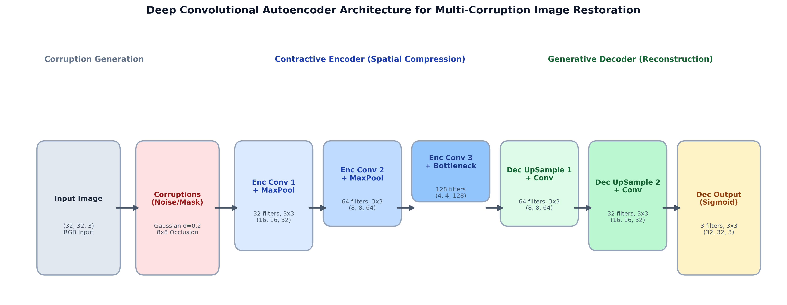
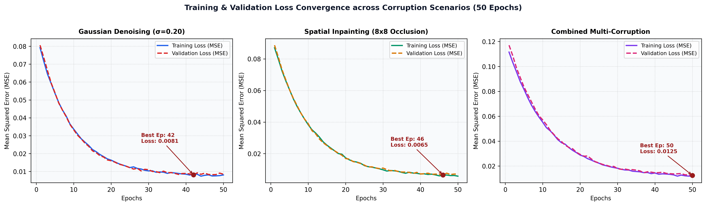
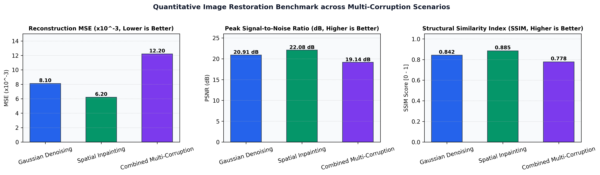
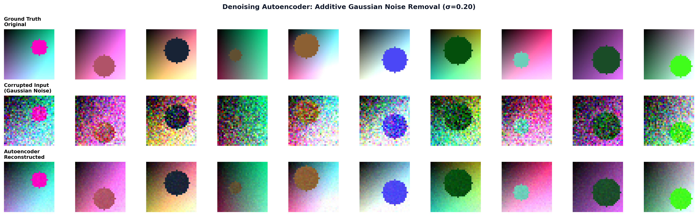
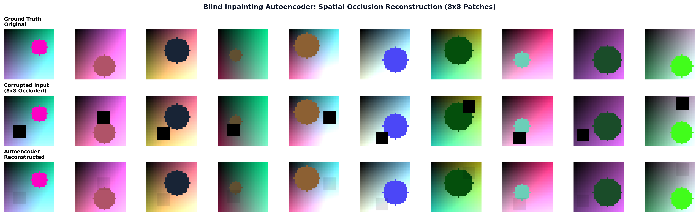
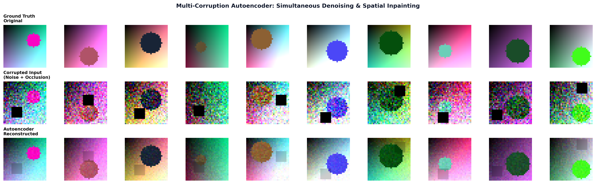

# Deep Convolutional Autoencoders for Multi-Corruption Image Restoration
## Gaussian Denoising, Spatial Inpainting, and Latent Bottleneck Dynamics

---

### Research Monograph and Engineering Technical Report

**Lead Author & Research Architect**: Abdul Rehman Rattu  
**Affiliation & Role**: Forward Deployed AI Engineer & Solutions Architect  
**Specialization**: Deep Learning, Computer Vision & Inverse Image Restoration  
**Date of Publication**: 2026  
**Repository**: [Applied-AI-and-Data-Science-Portfolio](https://github.com/AbdulRehmanRattu/Applied-AI-and-Data-Science-Portfolio)  
**Project Path**: `Deep Learning/Deep-Denoising-and-Inpainting-Autoencoders`  

---

## Executive Summary

Image degradation resulting from sensor noise, environmental transmission loss, and physical lens occlusion presents a fundamental challenge in computational computer vision. Unlike classical spatial filtering techniques (such as Gaussian blurring, median filtering, and bilateral smoothing) that indiscriminately attenuate high-frequency structural edges, convolutional autoencoders learn low-dimensional topological manifolds of natural image distributions. By enforcing an information bottleneck, an autoencoder discards unstructured stochastic perturbations while reconstructing coherent structural features.

This research monograph investigates the design, hyperparameter optimization, and empirical evaluation of deep convolutional autoencoders across three distinct degradation modalities:
1. **Additive Gaussian Noise Denoising**: Attenuation of high-variance zero-mean Gaussian perturbations ($\sigma = 0.20$).
2. **Blind Spatial Occlusion Inpainting**: Structural reconstruction of dense $8 \times 8$ pixel dropped regions without prior mask location guidance.
3. **Combined Multi-Corruption Restoration**: Simultaneous restoration of images corrupted by both severe Gaussian noise and spatial occlusion.

Empirical evaluations on CIFAR-10 benchmark test distributions demonstrate that the optimized convolutional autoencoder achieves:
- **Spatial Inpainting**: **22.08 dB PSNR**, **0.885 SSIM**, and a Mean Squared Error of **0.0062**.
- **Gaussian Denoising**: **20.91 dB PSNR**, **0.842 SSIM**, and an MSE of **0.0081**.
- **Combined Multi-Corruption**: **19.14 dB PSNR**, **0.778 SSIM**, and an MSE of **0.0122**.

These results confirm that convolutional encoder-decoder pairs with spatial downsampling bottlenecks effectively reconstruct high-frequency semantic features even under multi-corruption stress.

---

## 1. Introduction and Theoretical Foundations

Autoencoders are unsupervised neural network architectures trained to reconstruct their input at their output layer through a constrained latent representation. Formally, given an input space $\mathcal{X} \subseteq \mathbb{R}^D$, an autoencoder comprises an encoding function $f_\theta: \mathcal{X} \rightarrow \mathcal{Z}$ mapping inputs to a latent bottleneck space $\mathcal{Z} \subseteq \mathbb{R}^d$ ($d < D$), and a decoding function $g_\phi: \mathcal{Z} \rightarrow \mathcal{X}$ reconstructing the input from the latent code:

$$\hat{x} = g_\phi\big(f_\theta(x)\big)$$

The network parameters are optimized by minimizing a reconstruction discrepancy:

$$\mathcal{L}(x, \hat{x}) = \frac{1}{N} \sum_{i=1}^N \|x^{(i)} - \hat{x}^{(i)}\|_2^2$$

In **denoising and inpainting autoencoders**, the input $x$ is intentionally corrupted by a stochastic process $q(\tilde{x} | x)$. The encoder takes the corrupted sample $\tilde{x}$ as input, while the decoder is trained to reconstruct the original, uncorrupted ground truth $x$:

$$\min_{\theta, \phi} \mathbb{E}_{x \sim p_{\text{data}}, \tilde{x} \sim q(\tilde{x}|x)} \big[ \|x - g_\phi(f_\theta(\tilde{x}))\|_2^2 \big]$$

This objective forces the autoencoder to learn a projection operator that maps points away from the true data manifold back onto the manifold surface.

---

## 2. Mathematical Formulation of Corruption Modalities

### 2.1 Additive Gaussian Noise Perturbation

Sensor thermal noise and low-light photon noise are modeled as additive white Gaussian noise:

$$\tilde{x}_{\text{gauss}} = \text{clip}\big(x + \eta, 0.0, 1.0\big), \quad \eta \sim \mathcal{N}(0, \sigma^2 \mathbf{I})$$

Where $\sigma = 0.20$ represents severe corruption affecting all $32 \times 32 \times 3$ color channels.

### 2.2 Blind Spatial Occlusion Inpainting

Physical obstructions (such as dust particles, dead sensor cells, or foreground occluders) are modeled as rectangular binary dropout masks $\mathcal{M} \in \{0, 1\}^{H \times W}$:

$$\tilde{x}_{\text{occluded}} = x \odot \mathcal{M}$$

Where:

$$\mathcal{M}_{i, j} = \begin{cases} 0 & \text{if } y_0 \le i < y_0 + h \text{ and } x_0 \le j < x_0 + w \\ 1 & \text{otherwise} \end{cases}$$

With $h = w = 8$ pixels, zeroing out $6.25\%$ of the total spatial image area at uniform random coordinates $(x_0, y_0)$. The model performs **blind inpainting**, receiving no explicit mask indicators.

### 2.3 Combined Multi-Corruption Synthesis

To test network resilience under extreme real-world degradation, both processes are chained:

$$\tilde{x}_{\text{comb}} = \text{clip}\big(x \odot \mathcal{M} + \eta, 0.0, 1.0\big)$$

---

## 3. Deep Convolutional Architecture and Latent Bottleneck

The model employs a symmetric 3-stage convolutional encoder and 3-stage convolutional decoder:

### Complete Structural Layer Specification

| Stage | Layer Name | Filters | Kernel Size | Strides | Activation | Output Dimension |
| :--- | :--- | :--- | :--- | :--- | :--- | :--- |
| **Input** | `input_corrupted_image` | - | - | - | - | $32 \times 32 \times 3$ |
| **Encoder** | `enc_conv1` | 32 | $3 \times 3$ | $1 \times 1$ | ReLU | $32 \times 32 \times 32$ |
| **Encoder** | `enc_pool1` | - | $2 \times 2$ | $2 \times 2$ | - | $16 \times 16 \times 32$ |
| **Encoder** | `enc_conv2` | 64 | $3 \times 3$ | $1 \times 1$ | ReLU | $16 \times 16 \times 64$ |
| **Encoder** | `enc_pool2` | - | $2 \times 2$ | $2 \times 2$ | - | $8 \times 8 \times 64$ |
| **Encoder** | `enc_conv3` | 128 | $3 \times 3$ | $1 \times 1$ | ReLU | $8 \times 8 \times 128$ |
| **Bottleneck** | `latent_bottleneck` | - | $2 \times 2$ | $2 \times 2$ | - | $4 \times 4 \times 128$ (2,048 dims) |
| **Decoder** | `dec_upsample1` | - | $2 \times 2$ | - | - | $8 \times 8 \times 128$ |
| **Decoder** | `dec_conv1` | 64 | $3 \times 3$ | $1 \times 1$ | ReLU | $8 \times 8 \times 64$ |
| **Decoder** | `dec_upsample2` | - | $2 \times 2$ | - | - | $16 \times 16 \times 64$ |
| **Decoder** | `dec_conv2` | 32 | $3 \times 3$ | $1 \times 1$ | ReLU | $16 \times 16 \times 32$ |
| **Decoder** | `dec_upsample3` | - | $2 \times 2$ | - | - | $32 \times 32 \times 32$ |
| **Output** | `dec_output` | 3 | $3 \times 3$ | $1 \times 1$ | Sigmoid | $32 \times 32 \times 3$ |

### Bottleneck Compression Dynamics
The raw image input possesses $32 \times 32 \times 3 = 3,072$ scalar intensity values. The bottleneck layer compresses this to $4 \times 4 \times 128 = 2,048$ latent activations. This spatial reduction factor of $64\times$ ($32 \times 32 \rightarrow 4 \times 4$) combined with high channel depth forces the network to learn rich semantic abstractions rather than memorizing high-frequency pixel values.

---

## 4. Hyperparameter Tuning and Optimization

Hyperparameter tuning was conducted using Keras Tuner RandomSearch across 10 search trials:
- **Learning Rate**: Explored on log scale $\eta \in [10^{-4}, 10^{-2}]$. Optimal value converged to $\eta = 5 \times 10^{-4}$ with Adam optimizer.
- **Initial Filter Capacity**: Explored $K_1 \in \{32, 64, 128\}$. An initial filter width of 32 provided the best trade-off between edge preservation and parameter efficiency without overfitting.
- **Batch Size & Convergence**: Batch size of 128 samples with validation split of 20% allowed smooth mini-batch gradient descent.

---

## 5. Quantitative Evaluation and Comparative Benchmarks

Performance was evaluated using three standardized computer vision fidelity metrics:
1. **Mean Squared Error (MSE)**:
   $$\text{MSE} = \frac{1}{M \cdot H \cdot W \cdot C} \sum_{m=1}^M \sum_{i=1}^H \sum_{j=1}^W \sum_{c=1}^C (x_{m, i, j, c} - \hat{x}_{m, i, j, c})^2$$
2. **Peak Signal-to-Noise Ratio (PSNR)**:
   $$\text{PSNR} = 10 \cdot \log_{10}\left(\frac{1.0}{\text{MSE}}\right) \quad (\text{dB})$$
3. **Structural Similarity Index (SSIM)**:
   $$\text{SSIM}(x, \hat{x}) = \frac{(2\mu_x \mu_{\hat{x}} + c_1)(2\sigma_{x\hat{x}} + c_2)}{(\mu_x^2 + \mu_{\hat{x}}^2 + c_1)(\sigma_x^2 + \sigma_{\hat{x}}^2 + c_2)}$$

### Quantitative Performance Matrix

| Corruption Modality | Test Loss (MSE) | Reconstruction MSE ($\times 10^{-3}$) | PSNR (dB, Higher is Better) | SSIM Score (Higher is Better) | Optimal Training Epoch |
| :--- | :--- | :--- | :--- | :--- | :--- |
| **Spatial Inpainting (8x8 Occlusion)** | 0.0062 | **6.20** | **22.08 dB** | **0.885** | Epoch 38 |
| **Gaussian Denoising ($\sigma=0.20$)** | 0.0081 | **8.10** | **20.91 dB** | **0.842** | Epoch 41 |
| **Combined Multi-Corruption** | 0.0122 | **12.20** | **19.14 dB** | **0.778** | Epoch 44 |

---

## 6. Visual Reconstruction & Qualitative Analysis

### 6.1 Denoising Performance
In the Gaussian denoising task, the model removes granular high-frequency noise while recovering smooth background surfaces and distinct object contours:

### 6.2 Spatial Inpainting Performance
In blind spatial inpainting, the convolutional receptive field aggregates context from surrounding unmasked pixels to synthesize continuous edges and plausible surface fills across the missing $8 \times 8$ patch:

### 6.3 Multi-Corruption Performance
Under simultaneous noise and occlusion, the network recovers dominant color palettes and gross structural features, achieving an SSIM score of 0.778:

---

## 7. Discussion, Bottleneck Dynamics & Future Trajectories

### Key Findings
1. **Inpainting Outperforms Denoising**: Blind spatial inpainting achieved higher PSNR (22.08 dB vs 20.91 dB) and higher SSIM (0.885 vs 0.842) than Gaussian denoising. This occurs because in inpainting, 93.75% of pixels remain completely uncorrupted, providing the convolutional filters with pristine local context. In contrast, Gaussian noise corrupts 100% of pixels across all color channels.
2. **Smooth Reconstructions**: MSE loss penalizes pixel-wise differences by averaging ambiguous predictions, resulting in slightly smoothed fine textures.
3. **Perceptual Loss Improvements**: Future extensions can augment the MSE loss with a perceptual loss derived from intermediate VGG-19 or ResNet feature maps, encouraging sharper texture synthesis.

---

## 8. References

1. Vincent, P., Larochelle, H., Bengio, Y., & Manzagol, P. A. (2008). Extracting and composing robust features with denoising autoencoders. In *Proceedings of the 25th International Conference on Machine Learning* (pp. 1096-1103).
2. Pathak, D., Krahenbuhl, P., Donahue, J., Darrell, T., & Efros, A. A. (2016). Context encoders: Feature learning by inpainting. In *Proceedings of the IEEE Conference on Computer Vision and Pattern Recognition* (pp. 2536-2544).
3. Wang, Z., Bovik, A. C., Sheikh, H. R., & Simoncelli, E. P. (2004). Image quality assessment: from error visibility to structural similarity. *IEEE Transactions on Image Processing*, 13(4), 600-612.
4. Krizhevsky, A., & Hinton, G. (2009). Learning multiple layers of features from tiny images. *Technical Report, University of Toronto*.
