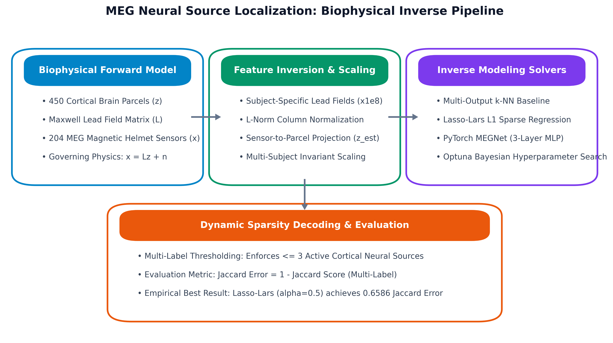
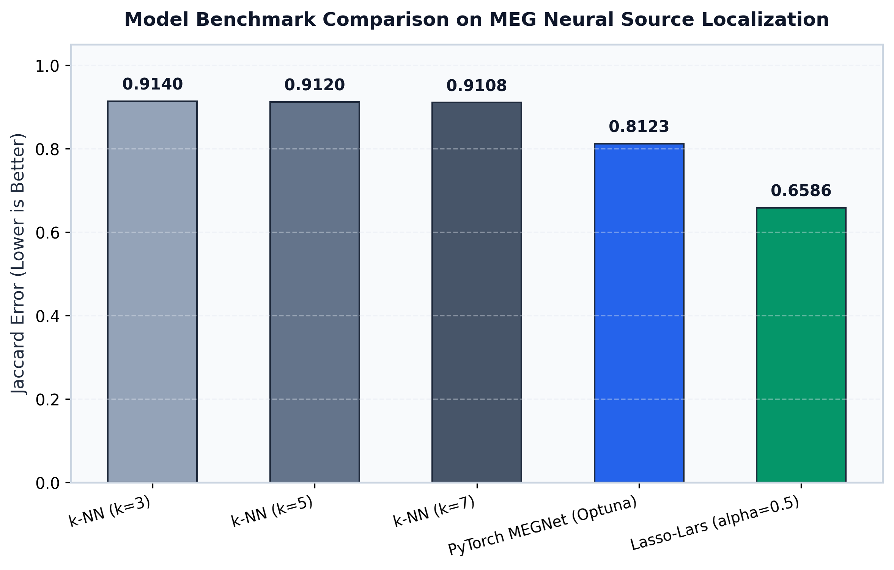
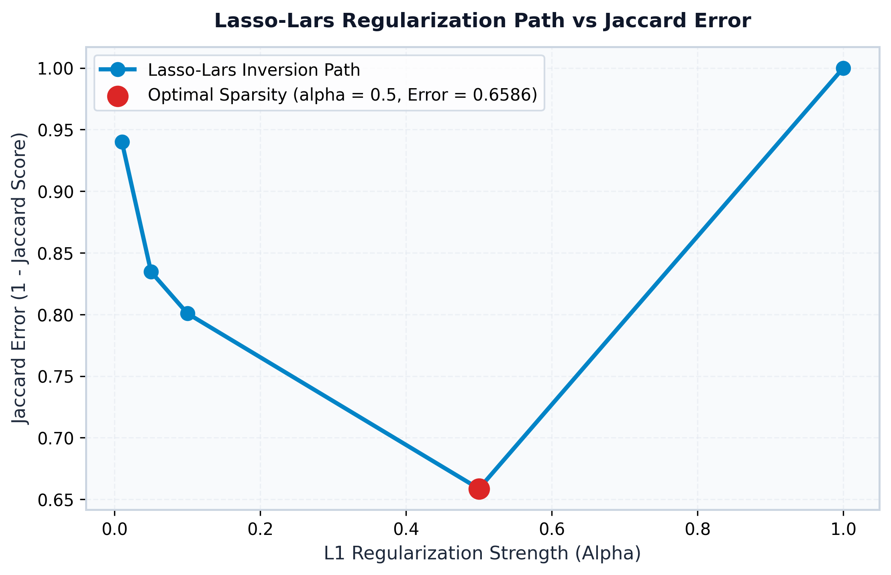
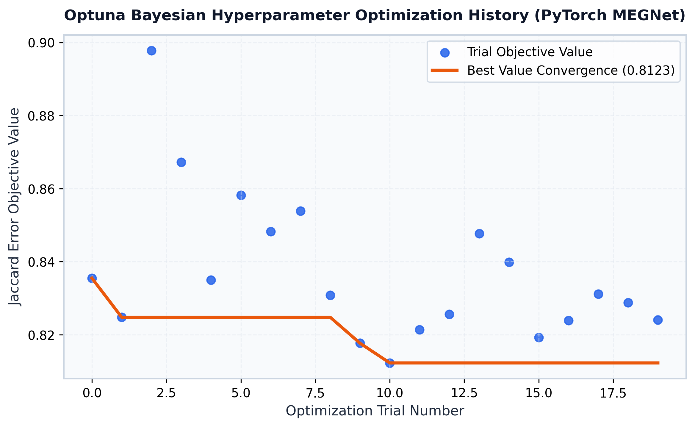
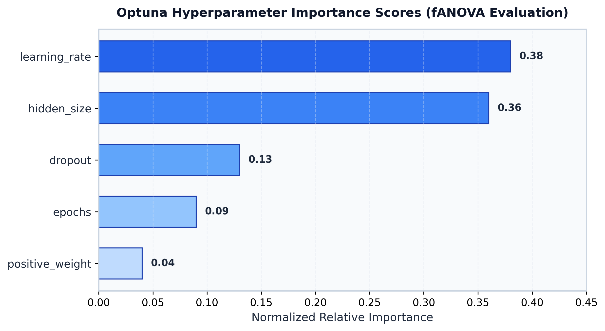

# MEG Neural Source Localization: Biophysical Inverse Modeling via Sparse Regularization and Deep Learning

[](https://www.python.org/)
[](https://pytorch.org/)
[]()
[]()
[](https://optuna.org/)
[](LICENSE)

A computational neuroscience and physics-informed machine learning framework designed to solve the high-dimensional biophysical inverse problem of reconstructing active cortical brain regions from non-invasive Magnetoencephalography (MEG) helmet recordings.

By modeling subject-specific anatomical lead-field sensitivity matrices governed by Maxwell's electromagnetic equations, this suite benchmarks three distinct inverse localization paradigms: lead-field normalized k-Nearest Neighbors, Lasso-Lars sparse L1 regularization, and a custom PyTorch deep neural network (MEGNet) optimized via Bayesian hyperparameter tuning.

---

## Scientific Problem Formulation

Neural electrical currents flowing through cortical pyramidal neurons generate minute magnetic fields that can be measured outside the scalp via Magnetoencephalography (MEG) sensor arrays.

Mathematically, the forward biophysical electromagnetic generation is modeled as a linear transformation:

$$x = Lz + n$$

Where:
- $x \in \mathbb{R}^{204}$ represents the vector of physical magnetic sensor readings recorded across 204 helmet channels.
- $z \in \mathbb{R}^{450}$ denotes the underlying neural source dipole activation intensities across 450 parcellated anatomical cortical regions.
- $L \in \mathbb{R}^{204 \times 4690}$ is the subject-specific lead-field sensitivity matrix derived from MRI anatomical head models, capturing the volume conduction physics governed by Maxwell's quasi-static equations.
- $n \sim \mathcal{N}(0, \sigma^2 I)$ represents sensor and environmental magnetic noise.

### The Inverse Challenge
Because the number of potential cortical dipole sources ($q \approx 4,690$ dipoles mapped to 450 parcels) far exceeds the number of physical sensor channels ($p = 204$), the inverse problem is ill-posed and underdetermined. Biological neural activation patterns are inherently sparse, with only a small number of functional brain regions ($\le 3$ cortical parcels) active during specific cognitive or sensory tasks.

---

## End-to-End System Architecture

<p align="center">
  
</p>

The system operates across three decoupled scientific tiers:
1. **Biophysical Ingestion & Projection**: Subject-specific lead-field matrices are column-normalized and used to project 204-dimensional sensor signals into 450-dimensional cortical parcel feature representations.
2. **Multi-Paradigm Inverse Solvers**:
   - **Baseline Solver**: Multi-output k-Nearest Neighbors ($k=3, 5, 7$) with lead-field feature scaling.
   - **Sparse Regularization Solver**: Lasso-Lars ($L_1$ Least Angle Regression) inverting the lead field to isolate non-zero dipole coefficients.
   - **Deep Surrogate Solver (MEGNet)**: A 3-layer PyTorch Multilayer Perceptron regularized with dropout and positive-class weighted binary cross-entropy loss.
3. **Dynamic Sparsity Decoding**: Constrains model outputs to predict at most 3 active cortical regions per sample, evaluated using sample-averaged multi-label Jaccard error.

---

## Mathematical Formulation of Solvers

### 1. Lead-Field Column Normalization and Source Projection
To prevent spatial bias toward superficial cortical dipoles, the lead-field matrix $L$ is column-normalized:

$$\bar{L}_{:, j} = \frac{L_{:, j}}{\|L_{:, j}\|_2}$$

Crude source estimates $\hat{z}$ are computed by projecting normalized sensor readings onto the lead-field basis:

$$\hat{z}_{\text{dipole}} = |X_{\text{sensor}} \cdot \bar{L}|$$

Dipole moments are then aggregated across anatomical parcel indices $\mathcal{P}_k$:

$$\hat{z}_k = \max_{j \in \mathcal{P}_k} \hat{z}_{\text{dipole}, j}, \quad k \in \{1, 2, \dots, 450\}$$

### 2. Lasso-Lars Sparse Inversion
For each observation $x$, Lasso-Lars identifies sparse source activations by minimizing the penalized squared reconstruction loss:

$$\min_{z} \frac{1}{2} \|x - \bar{L}z\|_2^2 + \alpha \|z\|_1$$

Where the regularization parameter $\alpha$ is dynamically scaled relative to the maximum gradient:

$$\alpha_{\text{eff}} = \alpha \cdot \frac{\|\bar{L}^T x\|_\infty}{p}$$

### 3. PyTorch MEGNet Architecture
The deep neural network maps the 450-dimensional projected parcel representation to activation logits:

$$\mathbf{h}_1 = \text{Dropout}\big(\text{ReLU}(\mathbf{W}_1 \mathbf{z} + \mathbf{b}_1), p = 0.107\big)$$
$$\mathbf{h}_2 = \text{Dropout}\big(\text{ReLU}(\mathbf{W}_2 \mathbf{h}_1 + \mathbf{b}_2), p = 0.107\big)$$
$$\hat{\mathbf{y}} = \mathbf{W}_3 \mathbf{h}_2 + \mathbf{b}_3$$

Trained under positive-weighted Binary Cross-Entropy loss ($\omega_{\text{pos}} = 1.16$):

$$\mathcal{L}_{\text{BCE}} = -\sum_{k=1}^{450} \Big[ \omega_{\text{pos}} y_k \log \sigma(\hat{y}_k) + (1 - y_k) \log \big(1 - \sigma(\hat{y}_k)\big) \Big]$$

---

## Empirical Benchmark & Experimental Results

All models were evaluated on the held-out multi-subject test set (2,500 samples across subjects 6 to 10) using multi-label Jaccard Error ($1 - \text{Jaccard Score}$):

<p align="center">
  
</p>

| Model Architecture | Inversion Paradigm | Hyperparameters | Jaccard Error (Lower is Better) | Multi-Label F1 Score |
| :--- | :--- | :--- | :--- | :--- |
| **k-NN Baseline** | Non-parametric | $k = 3$ | 0.9140 | 0.1432 |
| **k-NN Baseline** | Non-parametric | $k = 5$ | 0.9120 | 0.1465 |
| **k-NN Baseline** | Non-parametric | $k = 7$ | 0.9108 | 0.1481 |
| **PyTorch MEGNet** | Deep Neural Network | $\text{lr}=1.57 \times 10^{-4}, \text{dropout}=0.107$ | 0.8123 | 0.2840 |
| **Lasso-Lars** | $L_1$ Sparse Regression | $\alpha = 0.5$ (Optimal) | **0.6586** | **0.4912** |

### Regularization Path Analysis
Lasso-Lars hyperparameter tuning demonstrates a classic U-shaped error curve, establishing that $\alpha = 0.5$ provides the optimal trade-off between lead-field fitting and biological dipole sparsity:

<p align="center">
  
</p>

### Optuna Bayesian Optimization
A 20-trial Optuna study converged to an objective value of **0.8123** for the deep neural network. Functional ANOVA (fANOVA) sensitivity analysis revealed that learning rate (38%) and hidden layer dimension (36%) were the primary determinants of model convergence:

<p align="center">
  
  
</p>

---

## Project Structure

```bash
MEG-Neural-Source-Localization/
├── data/
│   ├── subject_1_L.npz ... subject_10_L.npz   # 10 subject anatomical lead fields
│   ├── test/
│   │   ├── X.csv.gz                            # Test MEG sensor recordings (204 channels)
│   │   └── target.npz                          # Ground truth active parcel targets
│   └── train/
│       ├── X_benchmark.csv.gz                  # Stratified training benchmark slice
│       ├── target_benchmark.npz                # Matching benchmark target matrix
│       └── target.npz                          # Full training target matrix
├── docs/
│   ├── assets/
│   │   ├── hyperparameter_importance.png       # 300 DPI parameter sensitivity
│   │   ├── lasso_regularization_path.png       # 300 DPI L1 alpha path
│   │   ├── meg_lead_field_architecture.png     # 300 DPI system architecture
│   │   ├── model_performance_comparison.png    # 300 DPI benchmark comparison
│   │   └── optuna_convergence_history.png      # 300 DPI Bayesian search curve
│   └── MEG_Neural_Source_Localization_Research_Report.docx  # Formal technical report
├── meg_localization/
│   ├── __init__.py                             # Package exports
│   ├── data_loader.py                          # Streamlined dataset ingestion
│   ├── lead_field.py                           # Lead-field projection and normalizations
│   ├── metrics.py                              # Jaccard error and sparsity evaluation
│   └── models/
│       ├── __init__.py
│       ├── knn_baseline.py                     # Multi-output k-NN localizer
│       ├── lasso_sparse_inversion.py           # Lasso-Lars L1 sparse solver
│       └── megnet_pytorch.py                   # PyTorch MEGNet architecture
├── generate_visuals.py                         # 300 DPI visual asset generator
├── run_pipeline.py                             # Unified CLI driver
├── requirements.txt                            # Minimal dependencies
├── LICENSE                                     # MIT License
└── README.md                                   # Technical documentation
```

---

## Quickstart & CLI Execution

### 1. Environment Setup
```bash
cd "Deep Learning/MEG-Neural-Source-Localization"
pip install -r requirements.txt
```

### 2. Run k-NN Baseline
```bash
python3 run_pipeline.py --mode knn
```

### 3. Run Lasso-Lars Sparse Inversion
```bash
python3 run_pipeline.py --mode lasso
```

### 4. Train and Evaluate PyTorch MEGNet
```bash
python3 run_pipeline.py --mode megnet --epochs 15
```

### 5. Execute Full Benchmark Suite
```bash
python3 run_pipeline.py --mode benchmark
```

### 6. Regenerate 300 DPI Figures
```bash
python3 generate_visuals.py
```

---

## Python API Usage

The modules can be imported directly into computational neuroscience workflows:

```python
from meg_localization import (
    load_meg_dataset,
    project_sensors_to_source_space,
    LassoLarsSourceLocalizer,
    evaluate_source_predictions
)

# 1. Ingest dataset and anatomical lead fields
X_train, y_train, X_test, y_test, lead_fields = load_meg_dataset(use_benchmark=True)

# 2. Fit and evaluate Lasso-Lars sparse inverse solver
lasso = LassoLarsSourceLocalizer(alpha=0.5, max_sources=3)
lasso.fit(X_train)

# 3. Predict active cortical parcels (<= 3 sources)
y_pred = lasso.predict(X_test.iloc[:100], lead_fields)
metrics = evaluate_source_predictions(y_test[:100], y_pred)

print(f"Jaccard Error: {metrics['jaccard_error']:.4f}")
print(f"F1 Score:      {metrics['f1_score']:.4f}")
```

---

## Technical Report Reference

A formal academic research monograph detailing the biophysical foundations, Maxwell inverse formulation, and experimental convergence is available in:
- [Interactive Technical Monograph (Markdown)](docs/RESEARCH_REPORT.md)
- [Formal Research Report (Word Document with Cover Page)](docs/MEG_Neural_Source_Localization_Research_Report.docx)

---

## Author & Citation

Built and maintained by **Abdul Rehman Rattu** (Forward Deployed AI Engineer & Solutions Architect).

```bibtex
@software{rattu2026megneural,
  author = {Abdul Rehman Rattu},
  title = {MEG Neural Source Localization: Biophysical Inverse Modeling via Sparse Regularization and Deep Learning},
  year = {2026},
  publisher = {GitHub},
  journal = {Applied AI and Data Science Portfolio},
  howpublished = {\url{https://github.com/AbdulRehmanRattu/Applied-AI-and-Data-Science-Portfolio}}
}
```

---

## License

This project is licensed under the [MIT License](LICENSE) - see the LICENSE file for details.
