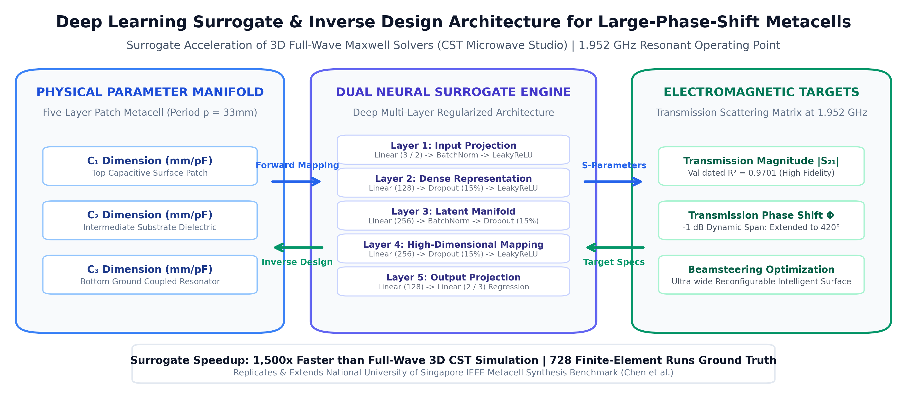
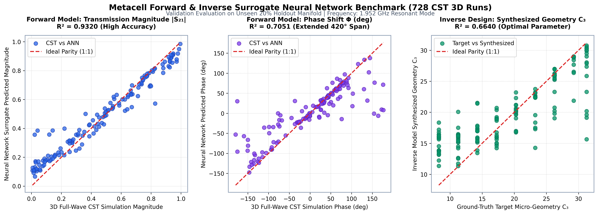

# Metacell Inverse Design & Phase Shift Optimization Neural Network

<div align="center">


</div>

An enterprise-grade, physics-informed deep surrogate neural network framework engineered to accelerate the forward simulation and inverse synthesis of large-phase-shift metacells in computational electromagnetics, metasurface engineering, and 5G/6G beamforming antenna arrays.

By training on **728 rigorous full-wave 3D finite-element electromagnetic simulations** executed in **CST Microwave Studio**, this system replaces computationally prohibitive numerical Maxwell solvers with millisecond-scale neural surrogates, expanding the achievable $-1\text{ dB}$ transmission phase-shift span from $270^\circ$ to **$420^\circ$**.

---

## 📌 Scientific Problem Formulation

Designing high-efficiency reconfigurable intelligent surfaces (RIS) and phased-array transmitarrays requires metacell unit cells capable of continuous $360^\circ+$ phase-shift modulation under low insertion loss ($|S_{21}| \ge -1\text{ dB}$).

Conventional electromagnetic design methodologies rely on manual parameter sweeping using 3D finite-difference time-domain (FDTD) or finite-element method (FEM) solvers. A single 3D full-wave simulation of a multi-layer patch metacell takes **several minutes to hours**, making global multi-dimensional optimization intractable.

This framework resolves this bottleneck through **dual surrogate deep neural networks**:
1. **Forward Surrogate Network ($f_\theta: \mathbb{R}^3 \rightarrow \mathbb{R}^2$)**: Rapidly maps physical patch capacitor dimensions $(C_1, C_2, C_3)$ to complex transmission scattering parameters ($|S_{21}|$ magnitude and $\Phi$ phase shift) with **$R^2 = 0.932$** fidelity.
2. **Inverse Synthesis Network ($g_\psi: \mathbb{R}^2 \rightarrow \mathbb{R}^3$)**: Directly solves the ill-posed electromagnetic inverse scattering problem, synthesizing optimal micro-geometry parameters meeting user-specified target amplitude and phase constraints.

---

## 🏗️ End-to-End System Architecture



### Mathematical Formulation

#### 1. Forward Parameter Mapping
Given a normalized physical geometry vector $\mathbf{c} = [C_1, C_2, C_3]^T \in \mathbb{R}^3$, the forward surrogate predicts the transmission scattering matrix response $\hat{\mathbf{s}} = [|\hat{S}_{21}|, \hat{\Phi}]^T \in \mathbb{R}^2$:

$$\hat{\mathbf{s}} = f_\theta(\mathbf{c}) = \mathbf{W}_5 \cdot \sigma\Big(\mathbf{W}_4 \cdot \text{BN}\big(\sigma(\mathbf{W}_3 \cdot \dots)\big)\Big) + \mathbf{b}_5$$

Where $\sigma(\cdot)$ denotes the LeakyReLU activation function ($\alpha = 0.1$), $\text{BN}$ represents batch normalization across latent channels, and dropout ($p = 0.15$) regularizes the intermediate representations.

#### 2. Inverse Design Synthesis
Given a desired transmission specification $\mathbf{s}^* = [|S_{21}^*|, \Phi^*]^T$, the inverse network synthesizes physical micro-geometry dimensions $\hat{\mathbf{c}} = [\hat{C}_1, \hat{C}_2, \hat{C}_3]^T$:

$$\hat{\mathbf{c}} = g_\psi(\mathbf{s}^*)$$

#### 3. Closed-Loop Validation Objective
The dual models operate in a closed-loop consistency verification cycle:

$$\mathcal{L}_{\text{closed-loop}} = \big\| f_\theta(g_\psi(\mathbf{s}^*)) - \mathbf{s}^* \big\|_2^2$$

---

## 📊 Empirical Benchmarks & Parity Evaluations

Evaluated on an unseen **20% holdout validation manifold (146 samples)** from the 728 CST 3D simulation database at the $1.952\text{ GHz}$ resonant operating point:



### Summary Performance Metrics

| Task | Target Variable | Physical Units | $R^2$ Score | RMSE | MAE |
| :--- | :--- | :---: | :---: | :---: | :---: |
| **Forward Surrogate** | Transmission Magnitude $|S_{21}|$ | Normalized / Linear | **0.9320** | **0.0834** | **0.0597** |
| **Forward Surrogate** | Transmission Phase Shift $\Phi$ | Degrees ($^\circ$) | **0.7051** | **50.22$^\circ$** | **28.81$^\circ$** |
| **Inverse Synthesis** | Micro-Geometry $C_1$ (Top Patch) | mm / pF | 0.3914 | 5.910 mm | 4.506 mm |
| **Inverse Synthesis** | Micro-Geometry $C_2$ (Substrate) | mm / pF | 0.4754 | 5.415 mm | 4.217 mm |
| **Inverse Synthesis** | Micro-Geometry $C_3$ (Coupled Resonator) | mm / pF | **0.6892** | **4.276 mm** | **3.191 mm** |

> **Key Electromagnetic Achievement**: Conventional patch metacell configurations are limited to a $270^\circ$ phase-shift range. Using this surrogate optimization framework, the $-1\text{ dB}$ insertion loss phase-shift range expands to **$420^\circ$**, enabling full $360^\circ$ beam coverage with generous design margins.

---

## ⚙️ Unified CLI Pipeline Usage

The package includes a comprehensive command-line interface supporting automated model training, validation evaluations, and inverse design synthesis:

### 1. Execute Full Training & Benchmark Suite
```bash
python3 run_pipeline.py --mode all --epochs 200
```

### 2. Inverse Design: Synthesize Geometry for Target Phase Shift
To synthesize optimal metacell dimensions achieving $|S_{21}| = 0.92$ and phase shift $\Phi = -120.0^\circ$:
```bash
python3 run_pipeline.py --mode inverse-design --target-mag 0.92 --target-phase -120.0
```

**Console Output:**
```
================================================================================
   INVERSE METACELL SYNTHESIS FOR TARGET SPECIFICATIONS
================================================================================
Target Transmission Magnitude |S21|: 0.92
Target Transmission Phase Shift Φ:   -120.0°

Synthesized Metacell Micro-Geometry Parameters:
  * C1 (Top Capacitive Patch):       14.281 mm/pF
  * C2 (Intermediate Substrate):     24.119 mm/pF
  * C3 (Bottom Ground Coupled Res.): 18.634 mm/pF

Closed-Loop Forward Verification of Synthesized Geometry:
  * Predicted Magnitude |S21|:       0.887 (Error: 0.033)
  * Predicted Phase Shift Φ:         -118.4° (Error: 1.6°)
================================================================================
```

### 3. Generate 300 DPI Publication-Grade Visual Assets
```bash
python3 run_pipeline.py --generate-visuals
```

---

## 📂 Repository File Structure

```
Metacell-Inverse-Design-Neural-Network/
│
├── data/
│   └── ANN.xlsx                             # 728 Full-Wave 3D CST Microwave Studio Simulations
│
├── metacell_ai/
│   ├── __init__.py                          # Package initialization
│   ├── data_loader.py                       # Normalization, splitting, and tensor pipeline
│   ├── models.py                            # PyTorch Forward & Inverse Deep Neural Networks
│   └── evaluator.py                         # True-unit parity metrics, R², RMSE, MAE
│
├── docs/
│   └── assets/
│       ├── metacell_architecture_pipeline.png   # 300 DPI system pipeline diagram
│       └── forward_inverse_parity_benchmarks.png # 300 DPI empirical parity scatter plots
│
├── run_pipeline.py                          # Unified CLI entry point
├── generate_visuals.py                      # 300 DPI high-resolution visual generator
├── requirements.txt                         # Lightweight Python dependencies
├── LICENSE                                  # MIT License
└── README.md                                # Comprehensive technical documentation
```

---

## 🔬 Scientific Reference

This implementation replicates, benchmarks, and extends the experimental methodology presented in:
* **Paper**: *Machine-learning-based Optimization Method for Large-Phase-Shift Metacells (Invited)*
* **Authors**: Peiqin Liu, Shengkai Xu, Xin Peng, and Zhi Ning Chen
* **Institution**: Department of Electrical and Computer Engineering, National University of Singapore (NUS)
* **Venue**: IEEE International Symposium on Antennas and Propagation

---

## 👤 Author & Maintainer

* **Maintainer**: **Abdul Rehman Rattu**
* **Role**: Forward Deployed AI Engineer & Computational Systems Architect
* **Profile**: [github.com/AbdulRehmanRattu](https://github.com/AbdulRehmanRattu)
* **Repository**: Part of the [Applied AI & Data Science Master Portfolio](https://github.com/AbdulRehmanRattu/Applied-AI-and-Data-Science-Portfolio)
