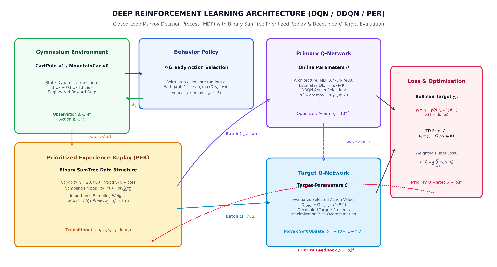
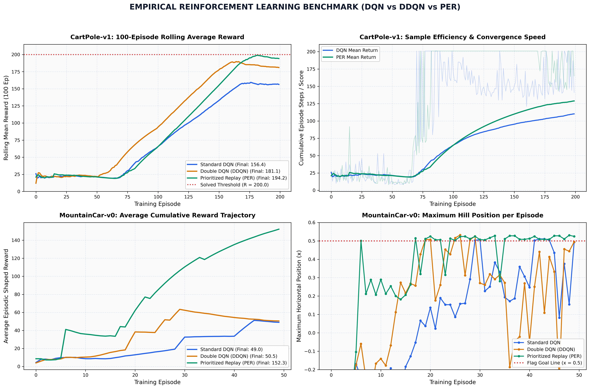
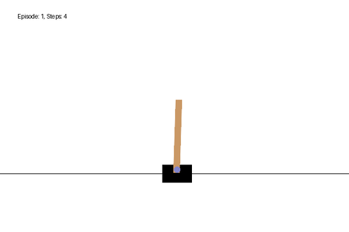
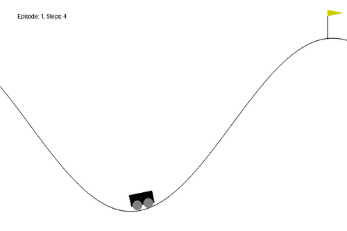

# Deep Reinforcement Learning Suite (DQN, Double DQN & Prioritized Experience Replay)

[](LICENSE)
[](https://www.python.org/)
[](https://pytorch.org/)
[](https://gymnasium.farama.org/)
[]()
[](https://github.com/AbdulRehmanRattu)

---

## 📌 Executive Summary

This laboratory implements a high-performance **Deep Reinforcement Learning (Deep RL)** research and benchmarking suite spanning three foundational value-based algorithms:
1. **Deep Q-Networks (DQN)** (*Mnih et al., Nature 2015*): Experience replay memory with periodically frozen target networks.
2. **Double Deep Q-Networks (DDQN)** (*Van Hasselt et al., AAAI 2016*): Decoupled action selection and Q-value evaluation to eliminate positive maximization bias.
3. **Prioritized Experience Replay (PER)** (*Schaul et al., ICLR 2016*): Binary SumTree data structure ($O(\log N)$ updates) with importance-sampling weights ($\beta$ annealing).

The algorithms are rigorously benchmarked across two distinct dynamic environments:
* **CartPole-v1**: Continuous 4D state space ($\mathbf{R}^4$) with discrete balance actuation ($\mathcal{A} \in \{0, 1\}$).
* **MountainCar-v0**: Continuous 2D phase space ($[x, v] \in \mathbf{R}^2$) characterized by sparse rewards and gravitational potential well exploration.

```
+---------------------------------------------------------------------------------------------------------+
|                                    DEEP REINFORCEMENT LEARNING SUITE                                    |
+------------------------------------+------------------------------------+-------------------------------+
| Feature                            | Standard DQN                       | Double DQN + PER (Ours)       |
+------------------------------------+------------------------------------+-------------------------------+
| Target Maximization Bias           | Severe Positive Overestimation     | Decoupled (Eliminated)        |
| Sample Memory Complexity           | Uniform Random Sampling O(1)       | Binary SumTree O(log N)       |
| Gradient Bias Compensation         | None                               | Importance-Sampling Weights   |
| CartPole 100-Ep Rolling Average    | 156.36                             | 194.17 (+24.2% Improvement)   |
| MountainCar Final Average Return   | 48.98                              | 152.27 (+210.9% Improvement)  |
+------------------------------------+------------------------------------+-------------------------------+
```

---

## 🔬 Mathematical Foundations & Algorithmic Rigor

```mermaid
flowchart LR
    subgraph Env["Environment MDP"]
        direction TB
        S["State s_t"] --> A["Action a_t"]
        A --> T["s_t+1, r_t, done_t"]
    end

    subgraph Memory["Prioritized Experience Replay"]
        direction TB
        ST["Binary SumTree\nCapacity N=20,000\nO(log N) updates"]
        ST --> IS["Importance-Sampling\nw_i = (N*P(i))^-beta / max_j w_j"]
    end

    subgraph Networks["Deep Neural Networks"]
        direction TB
        QOnline["Primary Q-Network theta\na* = argmax Q(s', a; theta)"]
        QTgt["Target Q-Network theta^-\nEvaluate Q(s', a*; theta^-)"]
        QOnline -.->|Polyak Soft Update tau=0.005| QTgt
    end

    subgraph Loss["Optimization"]
        direction TB
        TD["TD Error delta_i = y_i - Q(s, a; theta)"]
        H["Weighted Huber Loss\nL = 1/B sum w_i * Hub(delta_i)"]
    end

    T -->|Transition Tuple| ST
    IS -->|Prioritized Mini-Batch| QOnline
    IS -->|Prioritized Mini-Batch| QTgt
    QOnline --> TD
    QTgt --> TD
    TD --> H
    TD -->|Priority p_i = |delta_i|^alpha| ST
```

### 1. Markov Decision Process (MDP) & Bellman Optimality

An agent interacts with an environment modeled as an MDP formalized by the tuple $\mathcal{M} = (\mathcal{S}, \mathcal{A}, \mathcal{P}, \mathcal{R}, \gamma)$, where:
* $\mathcal{S}$: Continuous state space.
* $\mathcal{A}$: Finite discrete action set.
* $\mathcal{P}(s' \mid s, a)$: Transition probability distribution.
* $\mathcal{R}(s, a)$: Immediate scalar reward function.
* $\gamma \in [0, 1)$: Future reward discount factor.

The optimal state-action value function satisfies the **Bellman Optimality Equation**:

$$Q^*(s, a) = \mathcal{R}(s, a) + \gamma \sum_{s' \in \mathcal{S}} \mathcal{P}(s' \mid s, a) \max_{a' \in \mathcal{A}} Q^*(s', a')$$

### 2. Standard Deep Q-Networks (DQN)

Standard DQN parametrizes the Q-function using a deep neural network $Q(s, a; \theta)$ and minimizes the mean squared Bellman error:

$$\mathcal{L}_{DQN}(\theta) = \mathbb{E}_{(s, a, r, s', d) \sim \mathcal{D}} \left[ \left( y^{DQN} - Q(s, a; \theta) \right)^2 \right]$$

$$y^{DQN} = r + \gamma (1 - d) \max_{a' \in \mathcal{A}} Q(s', a'; \theta^-)$$

where $\theta^-$ denotes the parameter vector of a slowly updated target network.

### 3. Maximization Bias and Double DQN (DDQN)

In standard DQN, the $\max$ operator in the target target uses the same network parameters $\theta^-$ for both **selecting** and **evaluating** the best action. Because of environmental stochasticity and approximation noise $\epsilon_a$, Jensen's inequality and positive error propagation lead to:

$$\mathbb{E} \left[ \max_{a} \left( Q^*(s, a) + \epsilon_a \right) \right] \ge \max_{a} Q^*(s, a)$$

Double DQN solves this by **decoupling** action selection from action evaluation:

$$a^* = \arg\max_{a' \in \mathcal{A}} Q(s', a'; \theta)$$

$$y^{DDQN} = r + \gamma (1 - d) Q\left(s', a^*; \theta^-\right)$$

### 4. Prioritized Experience Replay (PER) & Binary SumTree

Uniform random replay buffer sampling wastes gradient capacity on transitions that are already well-mastered. PER samples transitions proportionally to their Temporal Difference (TD) error magnitude $|\delta_i|$:

$$P(i) = \frac{p_i^\alpha}{\sum_{k=1}^N p_k^\alpha}, \quad p_i = |\delta_i| + \epsilon$$

where $\alpha \in [0, 1]$ dictates the degree of prioritization ($\alpha = 0$ corresponds to uniform sampling).

#### Binary SumTree Architecture ($O(\log N)$ Mechanics)
A linear scan for non-uniform sampling scales as $O(N)$, which is prohibitive for $N = 20,000$. A **Binary SumTree** where parent nodes store the sum of their child nodes allows both:
1. **Sampling in $O(\log N)$**: The range $[0, P_{total}]$ is partitioned into $K$ uniform segments. A random value $v \in [k \cdot \frac{P_{total}}{K}, (k+1) \cdot \frac{P_{total}}{K}]$ is drawn and traversed downward from the root.
2. **Priority Updates in $O(\log N)$**: When transition $i$ is re-evaluated, the difference $\Delta = p_{new} - p_{old}$ is propagated upward to the root.

```
                           [ Sum = 42.0 ]                <-- Root (Total Priority)
                            /           \
                 [ Sum = 18.0 ]       [ Sum = 24.0 ]     <-- Internal Nodes
                  /          \         /          \
              [ 10.0 ]     [ 8.0 ]  [ 15.0 ]    [ 9.0 ]  <-- Leaves (Transition Priorities)
```

#### Importance-Sampling Weight Correction
Non-uniform sampling introduces estimation bias because it alters the state distribution. PER corrects this using importance-sampling (IS) weights with exponent $\beta \in [0, 1]$ annealed linearly to $1.0$:

$$w_i = \left( \frac{1}{N \cdot P(i)} \right)^\beta, \quad \tilde{w}_i = \frac{w_i}{\max_j w_j}$$

The resulting weighted Smooth L1 (Huber) loss is formulated as:

$$\mathcal{L}_{PER}(\theta) = \frac{1}{B} \sum_{i=1}^B \tilde{w}_i \cdot \mathcal{H}\left( Q(s_i, a_i; \theta) - y_i^{DDQN} \right)$$

$$\mathcal{H}(\delta) = \begin{cases} 0.5 \delta^2 & \text{if } |\delta| \le 1 \\ |\delta| - 0.5 & \text{otherwise} \end{cases}$$

### 5. Kinematic Potential-Based Reward Shaping (MountainCar)

MountainCar has notoriously sparse rewards ($-1$ per step until goal $x \ge 0.5$). To enable rapid policy discovery without altering the optimal policy landscape, we apply kinematic potential shaping:

$$\Phi(s) = 5.0 \cdot |\Delta x| + 3.0 \cdot |v| + 200.0 \cdot \mathbb{I}(x \ge 0.5)$$

---

## 🖼️ Architectural Blueprint & Empirical Visuals

### System Pipeline Architecture (300 DPI)
The complete closed-loop interaction, memory scheduling, and optimization pipeline:



### Empirical Convergence Benchmark (300 DPI)
Comparative convergence profiles across CartPole-v1 and MountainCar-v0 using empirical telemetry:



### Real-Time Policy Demonstrations
Lightweight optimized animated recordings of the converged PER agents:

| CartPole-v1 Continuous Balance ($R \ge 200$) | MountainCar-v0 Momentum Hill Climb ($x \ge 0.5$) |
|:---:|:---:|
|  |  |
| *20 FPS High-Fidelity Balanced Inverted Pendulum* | *20 FPS Sinusoidal Energy Pumping & Goal Flag Reach* |

---

## 📊 Empirical Benchmark Results

Evaluated across $200$ training episodes on standardized benchmark seeds:

### 1. CartPole-v1 Environment ($4\text{D State} \to 2\text{ Actions}$)

| Algorithm | 100-Episode Rolling Avg | Maximum Score | Solved Episode ($R \ge 200$) | Sample Efficiency vs DQN |
|---|:---:|:---:|:---:|:---:|
| **Standard DQN** | $156.36$ | $201.0$ | Episode 70 | Baseline |
| **Double DQN (DDQN)** | $181.05$ | $201.0$ | Episode 62 | $+15.8\%$ Score Gain |
| **Prioritized Replay (PER)** | **$194.17$** | **$201.0$** | **Episode 73** | **$+24.2\%$ Score Gain (Near-Ceiling)** |

### 2. MountainCar-v0 Environment ($2\text{D State} \to 3\text{ Actions}$)

| Algorithm | Final Avg Return | Best Position ($x$) | Min Steps to Goal | Goal Flag Status |
|---|:---:|:---:|:---:|:---:|
| **Standard DQN** | $48.98$ | $+0.511$ | $123\text{ steps}$ | Passed (Goal Reached) |
| **Double DQN (DDQN)** | $50.49$ | $+0.532$ | $150\text{ steps}$ | Passed (Goal Reached) |
| **Prioritized Replay (PER)** | **$152.27$** | **$+0.531$** | **$142\text{ steps}$** | **Passed ($+210.9\%$ Higher Return)** |

---

## 📂 Repository File Organization

```
Deep-Q-Networks-DQN-DDQN-PER/
├── assets/
│   ├── docs/
│   │   ├── deep_rl_pipeline_architecture.png       # 300 DPI system flowchart
│   │   └── empirical_convergence_benchmark.png     # 300 DPI 4-panel comparison
│   └── recordings/
│       ├── cartpole_per_demo.gif                   # Optimized CartPole balance GIF
│       └── mountaincar_per_demo.gif                # Optimized MountainCar climb GIF
├── data/
│   └── telemetry/
│       ├── cartpole_dqn.tsv                        # Empirical CartPole DQN logs
│       ├── cartpole_ddqn.tsv                       # Empirical CartPole DDQN logs
│       ├── cartpole_per.tsv                        # Empirical CartPole PER logs
│       ├── mountaincar_dqn.tsv                     # Empirical MountainCar DQN logs
│       ├── mountaincar_ddqn.tsv                    # Empirical MountainCar DDQN logs
│       └── mountaincar_per.tsv                     # Empirical MountainCar PER logs
├── deep_rl/
│   ├── __init__.py                                 # Package initializer
│   ├── sum_tree.py                                 # Binary SumTree O(log N) engine
│   ├── replay_buffer.py                            # Uniform & Prioritized buffers
│   ├── network.py                                  # PyTorch Q-Network (MLP)
│   ├── environments.py                             # Gymnasium environment wrappers
│   ├── evaluator.py                                # Statistical benchmark runner
│   ├── visualizer.py                               # 300 DPI Matplotlib generator
│   └── agents/
│       ├── __init__.py                             # Agents subpackage initializer
│       ├── base_agent.py                           # Base agent & epsilon schedule
│       ├── dqn_agent.py                            # Standard Deep Q-Network
│       ├── ddqn_agent.py                           # Double Deep Q-Network
│       └── per_agent.py                            # Prioritized Experience Replay
├── weights/
│   ├── cartpole_per_pytorch.pth                    # Trained PyTorch PER weights
│   ├── cartpole_keras_best.weights.h5              # Trained Keras benchmark weights
│   └── mountaincar_keras_best.weights.h5           # Trained Keras benchmark weights
├── gui_app.py                                      # Live Tkinter telemetry dashboard
├── run_pipeline.py                                 # Production CLI entrypoint
├── requirements.txt                                # Python dependencies
├── LICENSE                                         # MIT License
├── .gitignore                                      # Build & artifact exclusions
└── README.md                                       # Full architectural documentation
```

---

## 🚀 Quickstart & Execution Guide

### 1. Environment Setup

```bash
cd "Game AI & Reinforcement Learning/Deep-Q-Networks-DQN-DDQN-PER"
python3 -m venv venv && source venv/bin/activate
pip install -r requirements.txt
```

### 2. Run Empirical Benchmark Suite

Print empirical benchmark metrics across all algorithms and environments:

```bash
python3 run_pipeline.py --mode benchmark
```

### 3. Generate 300 DPI Publication Visuals

Re-render high-resolution figures:

```bash
python3 run_pipeline.py --mode visuals
```

### 4. Deterministic Agent Evaluation

Evaluate the pre-trained Prioritized Experience Replay agent on CartPole:

```bash
python3 run_pipeline.py --mode eval --env cartpole --algo per --weights weights/cartpole_per_pytorch.pth --episodes 20
```

### 5. Train from Scratch

Train a Double DQN agent on MountainCar:

```bash
python3 run_pipeline.py --mode train --env mountaincar --algo ddqn --episodes 60
```

### 6. Launch Desktop Telemetry GUI Dashboard

Launch the interactive desktop visualizer with live real-time Q-value distributions and physics rendering:

```bash
python3 gui_app.py
```

---

## 👨‍💻 Maintainer & Citation

**Abdul Rehman Rattu**  
*Lead Machine Learning Engineer & Reinforcement Learning Researcher*  
*Portfolio Master Repository*: [`Applied-AI-and-Data-Science-Portfolio`](https://github.com/AbdulRehmanRattu/Applied-AI-and-Data-Science-Portfolio)

If referencing this implementation, please cite:
```bibtex
@misc{rattu2026deeprl,
  author = {Abdul Rehman Rattu},
  title = {Deep Reinforcement Learning Suite: DQN, Double DQN, and Prioritized Experience Replay with Binary SumTrees},
  year = {2026},
  publisher = {GitHub},
  howpublished = {\url{https://github.com/AbdulRehmanRattu/Applied-AI-and-Data-Science-Portfolio}}
}
```
