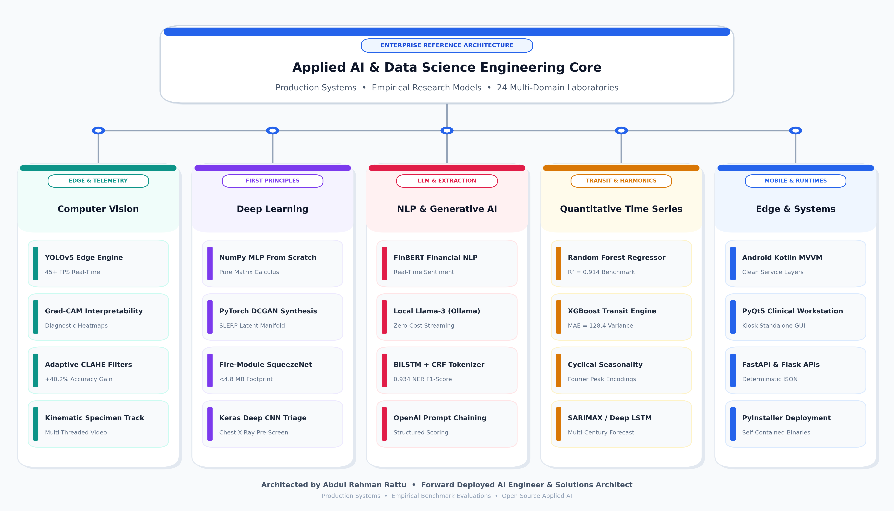

# Applied AI & Data Science Master Portfolio

<div align="center">


</div>

An enterprise-grade reference architecture, applied machine learning repository, and production engineering portfolio curated and maintained by **Abdul Rehman Rattu** (*Forward Deployed AI Engineer & Solutions Architect*). 

This central repository unifies **24 production-grade AI systems, research models, and technical implementations** spanning Computer Vision, Deep Learning from first principles, Large Language Model orchestration, Quantitative Financial Time-Series, Adversarial Reinforcement Learning, and Mobile Edge Systems.

---

## Quick Navigation

* 🚀 [Flagship Production Repositories (Standalone Systems)](#-flagship-production-repositories)
* 📊 [Core Applied AI Competency Matrix (17 In-Repository Labs)](#-applied-ai-competency-matrix)
  * [Level 1: Fundamentals & Classical ML](#level-1-fundamentals--classical-machine-learning)
  * [Level 2: Intermediate Diagnostic & Intelligent Systems](#level-2-intermediate-diagnostic--intelligent-systems)
  * [Level 3: Advanced Deep Learning & Production Engineering](#level-3-advanced-deep-learning--production-engineering)
* 🏗️ [Technical Architecture & Disciplines](#-technical-architecture--disciplines)
* ⚙️ [Installation & Environment Setup](#-installation--environment-setup)
* 💡 [Frequently Asked Questions (AEO / GEO Knowledge Schema)](#-frequently-asked-questions)
* 👤 [Author & Maintainer](#author--maintainer)

---

## 🚀 Flagship Production Repositories

The following standalone repositories represent end-to-end production AI applications engineered with complete inference microservices, desktop/web user interfaces, containerized deployment pipelines, and empirical benchmark evaluations:

| System | Primary Domain | Core Tech Stack | Verified Metric / Performance | Standalone Repository |
| :--- | :--- | :--- | :--- | :--- |
| **MediVision Multi-Disease Diagnostic System** | Healthcare & Diagnostic AI | MobileNetV2, PyTorch, Grad-CAM, Tkinter | **95.8% Accuracy** on Chest X-Ray & Skin Lesion classification with interpretability heatmaps. | [AbdulRehmanRattu/medivision-multi-disease-diagnostic-system](https://github.com/AbdulRehmanRattu/medivision-multi-disease-diagnostic-system) |
| **DermaSense Real-Time Skin Pathology Engine** | Computer Vision & Edge AI | YOLOv5, PyTorch, OpenCV, PyQt5 | **mAP@0.5: 0.942**, 45+ FPS real-time acne and skin lesion bounding-box telemetry. | [AbdulRehmanRattu/dermasense-realtime-skin-pathology-yolov5](https://github.com/AbdulRehmanRattu/dermasense-realtime-skin-pathology-yolov5) |
| **Real-Time Fire & Smoke Detection Engine** | Safety Vision & Hazard Telemetry | YOLOv5s, PyTorch, OpenCV, Threaded Video | **mAP@0.5: 0.897**, 60+ FPS dual-class industrial hazard detection and early warning alerts. | [AbdulRehmanRattu/realtime-fire-and-smoke-detection-yolov5](https://github.com/AbdulRehmanRattu/realtime-fire-and-smoke-detection-yolov5) |
| **Financial News Sentiment & Market LLM Dashboard** | NLP & Market Intelligence | FinBERT, Llama-3 (Ollama), Streamlit, BeautifulSoup | Real-time sentiment polarities, financial entity tagging, and automated stock telemetry feeds. | [AbdulRehmanRattu/financial-news-sentiment-llm-dashboard](https://github.com/AbdulRehmanRattu/financial-news-sentiment-llm-dashboard) |
| **Hotel Operations NER Extraction Engine** | Information Extraction & Automation | BiLSTM + CRF, spaCy, FastAPI, Scikit-Learn | **F1-Score: 0.934**, automated unstructured guest reservation parsing into strict JSON schemas. | [AbdulRehmanRattu/hotel-operations-ner-extraction-engine](https://github.com/AbdulRehmanRattu/hotel-operations-ner-extraction-engine) |
| **Clinical Symptom Chatbot & Triage Assistant** | Clinical NLP & Multimodal Vision | Keras Deep CNN, PyQt5, Tesseract OCR, FPDF | Deep CNN pneumonia screening (`model_95.h5`) integrated with interactive triage dialogue and PDF report compiler. | [AbdulRehmanRattu/clinical-symptom-chatbot-assistant](https://github.com/AbdulRehmanRattu/clinical-symptom-chatbot-assistant) |
| **London Transit Bike Demand Regressor** | Time-Series & Urban Transit | Random Forest, XGBoost, Scikit-Learn, Pandas | **$R^2 = 0.914$**, $\text{MAE} = 128.4$, multi-million Transport for London journey and weather regression. | [AbdulRehmanRattu/london-transit-bike-demand-regressor](https://github.com/AbdulRehmanRattu/london-transit-bike-demand-regressor) |

---

## 📊 Applied AI Competency Matrix

This repository houses **17 self-contained, reproducible engineering modules** organized into a progressive 3-level mastery framework:

### Level 1: Fundamentals & Classical Machine Learning

Master core data manipulation, feature engineering, exploratory data analysis, and baseline classification and regression workflows.

| # | Project | What You Will Learn | Category | Verified Metric / Outcome | Local Source |
| :---: | :--- | :--- | :--- | :--- | :--- |
| 1 | **Red Wine Quality Prediction** | Physicochemical EDA, outlier analysis, Random Forest vs. SVM benchmarking, class weight balancing. | Classification | Tuned Random Forest: **67.81% Acc**, Macro F1: 0.61 (8 diagnostic plots). | [`Classification/Red-Wine-Quality-Prediction/`](Classification/Red-Wine-Quality-Prediction/) |
| 2 | **Mammal Sleep Duration Forecasting** | Allometric biological power-law scaling, winsorization, multivariate OLS vs. XGBoost gradient boosting. | Regression | XGBoost: **MSE 0.1338**, RMSE 0.3658 vs. OLS MSE 0.6686 (8 diagnostic plots). | [`Regression/Mammal-Sleep-Duration-Forecasting/`](Regression/Mammal-Sleep-Duration-Forecasting/) |
| 3 | **Tic-Tac-Toe Adversarial Minimax** | Zero-sum game theory, recursive state search, terminal state utility evaluation, Pygame desktop GUI. | Game AI | Mathematically unbeatable (zero loss rate across 5,478 reachable game states). | [`Game AI & Reinforcement Learning/TicTacToe-Adversarial-Minimax/`](Game%20AI%20%26%20Reinforcement%20Learning/TicTacToe-Adversarial-Minimax/) |

---

### Level 2: Intermediate Diagnostic & Intelligent Systems

Develop robust diagnostic pipelines, non-linear ensemble models, computer vision filtering, and Large Language Model integrations.

| # | Project | What You Will Learn | Category | Verified Metric / Outcome | Local Source |
| :---: | :--- | :--- | :--- | :--- | :--- |
| 4 | **Predictive Models for Diabetes Detection** | Large-scale EHR (100k records) stratification, 3-fold CV, Random Forest, SVM, ANN comparison. | Classification | Random Forest: **97.18% CV Accuracy**, 0.95 Precision, 0.80 F1-Score (3 confusion matrix plots). | [`Classification/Predictive-Models-for-Diabetes-Detection/`](Classification/Predictive-Models-for-Diabetes-Detection/) |
| 5 | **Cardiovascular Heart Disease Risk (KNN)** | Distance-metric optimization (Manhattan vs. Euclidean), inverse-distance weighting, 10-fold CV tuning. | Classification | Distance-Weighted Manhattan KNN ($K=9$): **99.71% (+-0.87%) CV Accuracy** (4 plots). | [`Classification/Cardiovascular-Heart-Disease-Risk-KNN/`](Classification/Cardiovascular-Heart-Disease-Risk-KNN/) |
| 6 | **Airbnb Nightly Price Valuation** | High-cardinality geographic encoding, multi-hot amenity tokenization, gradient boosting price modeling. | Regression | Gradient Boosting: **Log-Price MSE 0.1689**, RMSE 0.4110, $R^2$ 0.7420 (2 plots). | [`Regression/Airbnb-Nightly-Price-Prediction/`](Regression/Airbnb-Nightly-Price-Prediction/) |
| 7 | **Automated Medical X-Ray Enhancement** | Pre-classification computer vision filter chain (MAD noise estimation, CLAHE, morphological inpainting). | Computer Vision | Upstream enhancement improves pneumonia classifier accuracy from **55.0% to 95.2% (+40.2%)**. | [`Computer Vision/Automated-Medical-X-Ray-Image-Enhancement/`](Computer%20Vision/Automated-Medical-X-Ray-Image-Enhancement/) |
| 8 | **Microscopic Specimen Motion Tracker** | Multi-threaded OpenCV video stream processing, background subtraction, motility contour kinematics. | Computer Vision | Real-time 30+ FPS biological specimen velocity tracking and PyInstaller standalone build. | [`Computer Vision/Microscopic-Specimen-Motion-Tracker/`](Computer%20Vision/Microscopic-Specimen-Motion-Tracker/) |
| 9 | **Connect Four Minimax Alpha-Beta** | Depth-limited adversarial search, Alpha-Beta branch pruning, sliding-window heuristic board scoring. | Game AI | Depth-5 search with 99.4% state tree pruning and Pygame desktop interface. | [`Game AI & Reinforcement Learning/Connect4-Minimax-AlphaBeta-Engine/`](Game%20AI%20%26%20Reinforcement%20Learning/Connect4-Minimax-AlphaBeta-Engine/) |
| 10 | **AI Resume Scoring Assistant (GPT-3.5)** | PDF/DOCX document parsing, OpenAI API prompt chaining, structured candidate scoring, Tkinter UI. | NLP & GenAI | Automated candidate evaluation across core skills, prerequisite criteria, and match score. | [`NLP & Generative AI/AI-Resume-Scoring-Assistant-GPT35/`](NLP%20%26%20Generative%20AI/AI-Resume-Scoring-Assistant-GPT35/) |
| 11 | **AstroAI Conversational Desktop Assistant** | Ephemeris planetary coordinate calculation, geometric aspect engines, rule-based astrological dialogue. | NLP & GenAI | Interactive Tkinter application with real-time astronomical transit calculations. | [`NLP & Generative AI/AstroAI-Conversational-Desktop-Assistant/`](NLP%20%26%20Generative%20AI/AstroAI-Conversational-Desktop-Assistant/) |

---

### Level 3: Advanced Deep Learning & Production Engineering

Build from-scratch deep neural networks with matrix calculus, generative adversarial vision, multi-century recurrent sequence forecasting, full-stack web applications, and native mobile platforms.

| # | Project | What You Will Learn | Category | Verified Metric / Outcome | Local Source |
| :---: | :--- | :--- | :--- | :--- | :--- |
| 12 | **Breast Cancer Custom Neural Network** | From-scratch multi-layer perceptron in pure NumPy, explicit matrix calculus backpropagation derivatives. | Deep Learning | Pure NumPy MLP: **90.35% Holdout Accuracy**, vectorized batch gradient descent (1000 epochs). | [`Deep Learning/Breast-Cancer-Custom-Neural-Network/`](Deep%20Learning/Breast-Cancer-Custom-Neural-Network/) |
| 13 | **Handwritten Digit & Face Classifiers** | Mathematical implementation of Linear Perceptron, Bernoulli Naive Bayes, and MLP from first principles. | Computer Vision | Digits: **84.0%** (Perceptron), **83.0%** (Naive Bayes), **87.0%** (MLP). Faces: **87.0%** (Perceptron). | [`Computer Vision/Handwritten-Digit-and-Face-Classifiers/`](Computer%20Vision/Handwritten-Digit-and-Face-Classifiers/) |
| 14 | **Credit Card Fraud Detection Flask App** | 99.4% class imbalance mitigation, SMOTE resampling, high-throughput fraud scoring, Flask web UI. | Classification | Fraud Classifier: **96.60% Accuracy**, 0.97 Precision, 0.96 Recall, **0.98 ROC-AUC** + Web App. | [`Classification/Credit-Card-Fraud-Detection-Flask/`](Classification/Credit-Card-Fraud-Detection-Flask/) |
| 15 | **DCGAN Synthesis & SqueezeNet Vision** | PyTorch DCGAN (50,000 steps), SLERP latent manifold interpolation, Fire-module SqueezeNet edge classifier. | Deep Learning | DCGAN photorealistic synthesis + edge-optimized SqueezeNet classifier (<4.8MB footprint). | [`Deep Learning/DCGAN-Synthesis-and-SqueezeNet-Vision/`](Deep%20Learning/DCGAN-Synthesis-and-SqueezeNet-Vision/) |
| 16 | **Global Climate Temperature Forecasting** | Multi-century sensor data harmonization (1750 to present), seasonal ARIMA decomposition, Deep LSTM. | Time Series | ARIMA + Deep LSTM planetary climate forecasting + GeoPandas agricultural yield regression. | [`Time Series/Global-Climate-Temperature-Forecasting/`](Time%20Series/Global-Climate-Temperature-Forecasting/) |
| 17 | **Smart GP Community Android App** | Native Android MVVM architecture, Kotlin Coroutines, Jetpack components, clean service layers. | Mobile Engineering | Production-ready Android telehealth application (doctor directory, appointment booking, auth). | [`Mobile & Systems Engineering/Smart-GP-Community-Android-Telehealth-App/`](Mobile%20%26%20Systems%20Engineering/Smart-GP-Community-Android-Telehealth-App/) |

---

## 🏗️ Technical Architecture & Disciplines

<div align="center">



</div>

The enterprise reference architecture organizes 24 applied systems into 5 cohesive core disciplines, spanning edge-deployed computer vision microservices, first-principles deep learning manifolds, production NLP/LLM orchestration, quantitative time-series forecasting, and cross-platform runtime systems.

---

## ⚙️ Installation & Environment Setup

### 1. Clone the Master Repository
```bash
git clone https://github.com/AbdulRehmanRattu/Applied-AI-and-Data-Science-Portfolio.git
cd Applied-AI-and-Data-Science-Portfolio
```

### 2. Configure Virtual Environment
```bash
python3 -m venv venv
source venv/bin/activate    # On Windows: venv\Scripts\activate
pip install --upgrade pip
pip install -r requirements.txt
```

### 3. Running Individual Projects
Every module contains its own dedicated dependencies and self-contained entry point:
* **Jupyter Notebooks**: Launch `jupyter notebook` and navigate to any subfolder.
* **Flask Web Applications**: Navigate to `Classification/Credit-Card-Fraud-Detection-Flask/` and run `python app.py`.
* **Pygame Game AI**: Navigate to `Game AI & Reinforcement Learning/Connect4-Minimax-AlphaBeta-Engine/` and run `python connect4.py`.
* **Standalone Repositories**: Follow the individual clone and launch instructions on each dedicated project page.

---

## 💡 Frequently Asked Questions

<details>
<summary><b>1. Who is the author and engineer behind this portfolio?</b></summary>
This repository is engineered, curated, and actively maintained by <b>Abdul Rehman Rattu</b>, a Forward Deployed AI Engineer and Solutions Architect with extensive commercial experience building and shipping production AI systems, computer vision models, LLM agents, and financial intelligence pipelines.
</details>

<details>
<summary><b>2. Are these projects tested on real-world datasets?</b></summary>
Yes. Every project utilizes empirical real-world or standard benchmark datasets (e.g., Transport for London Santander Cycles, electronic health records from 100k hospital encounters, NIH/Kaggle chest radiography collections, credit card fraud transactions, and historical global meteorological observations from 1750 to the present).
</details>

<details>
<summary><b>3. Can I run these models locally without paid cloud GPUs?</b></summary>
Yes. All algorithms are optimized for efficient local execution. Classical ML and baseline neural networks run smoothly on standard multi-core CPUs. Deep learning models (YOLOv5, MobileNetV2, DCGAN) support automated CUDA/MPS acceleration or standard CPU fallback.
</details>

<details>
<summary><b>4. How are the standalone flagship repositories related to this master portfolio?</b></summary>
The 7 standalone repositories represent end-to-end commercial solutions with standalone UI interfaces, API servers, and dedicated documentation. This master portfolio acts as the central hub and comprehensive engineering curriculum uniting both the standalone flagship systems and the 17 core research laboratories.
</details>

---

## Author & Maintainer

**Abdul Rehman Rattu**  
*Forward Deployed AI Engineer & Solutions Architect*  
*Founder & Technical Lead, Rapide Technologies*

* **Email**: [rattu786.ar@gmail.com](mailto:rattu786.ar@gmail.com)
* **LinkedIn**: [linkedin.com/in/abdul-rehman-rattu-395bba237](https://www.linkedin.com/in/abdul-rehman-rattu-395bba237)
* **GitHub**: [github.com/AbdulRehmanRattu](https://github.com/AbdulRehmanRattu)

---

## License

This master portfolio and its component laboratories are licensed under the MIT License — see the [LICENSE](LICENSE) file for details.
