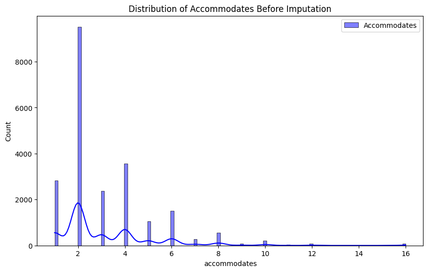
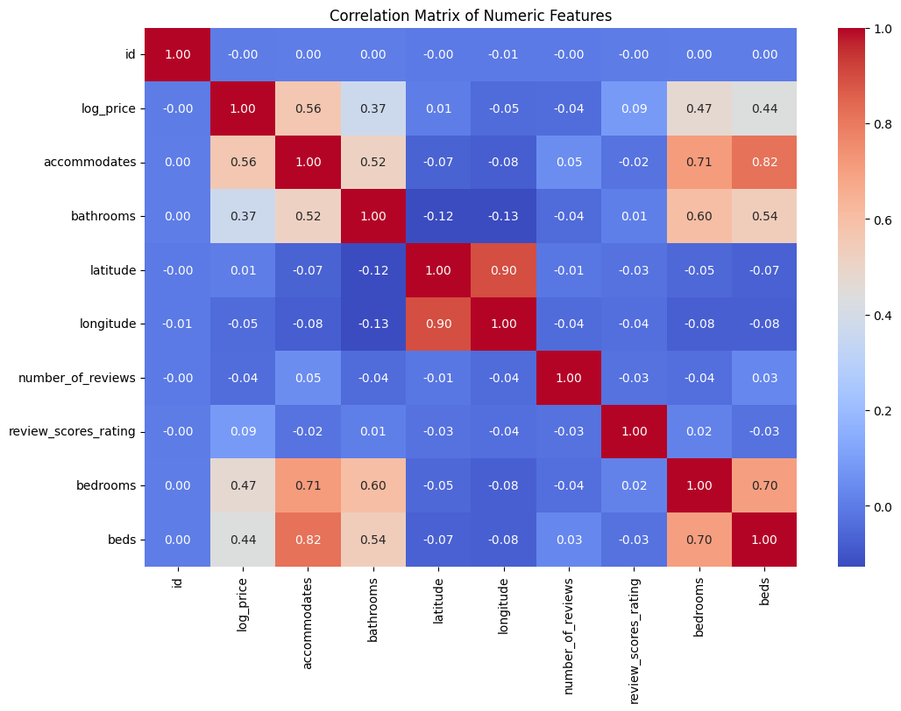

# Airbnb Nightly Price Prediction and Dynamic Valuation Engine

## Overview

Accurate pricing in short-term rental markets is critical for maximizing property host revenue while maintaining competitive occupancy rates. Dynamic pricing must account for multifaceted property characteristics, geographic variations, amenity offerings, and host reputation metrics.

This project develops an end-to-end price valuation and regression pipeline trained on comprehensive Airbnb listing datasets. By combining automated missing value imputation, multi-hot amenity extraction, geospatial encoding, and gradient-boosted ensemble modeling, the framework predicts the natural logarithm of nightly listing prices (`log_price`) with a Mean Squared Error (MSE) of 0.169.

---


---

## Problem Statement

Property hosts and short-term rental platforms face significant pricing optimization challenges due to high market volatility, heterogeneous property configurations, seasonal demand shifts, and varying amenity combinations. Hosts frequently misprice listings, resulting in suboptimal occupancy rates or suppressed revenue. An automated dynamic valuation model is required to accurately predict competitive nightly listing prices based on listing capacity, location coordinates, property types, and amenity density.

## Key Features

- Automated Multi-Modal Preprocessing: Imputes numerical gaps (bathrooms, bedrooms) and encodes high-cardinality geographic coordinates.
- Multi-Hot Amenity Tokenization: Parses unstructured amenity string arrays into sparse feature representations.
- Gradient Boosted Price Estimation: Achieves a low Mean Squared Error (MSE: 0.1689) predicting log-transformed listing prices.
- Automated Test Batch Scoring: Generates compliant prediction CSV exports for unlabelled evaluation cohorts.

## Technical Specifications

| Parameter | Specification |
| :--- | :--- |
| **Language** | Python 3.8+ |
| **Machine Learning** | Scikit-Learn (Gradient Boosting, Random Forest, Ridge) |
| **Data Processing** | Pandas, NumPy |
| **Feature Extraction** | CountVectorizer (Amenities), OneHotEncoder |
| **Visualization** | Matplotlib, Seaborn |

## System Architecture and Workflow

```
[ Raw Listing Data (airbnb_train.csv, Multi-Modal Attributes) ]
 |
 v
[ Preprocessing & Automated Imputation Pipeline ]
 + Distribution Modeling & Anomaly Inspection
 + Median Imputation for Numerical Gaps (Bathrooms, Bedrooms, Beds)
 + Frequency/Mode Imputation for Host Metadata
 + Categorical One-Hot Encoding (City, Property Type, Room Type, Policy)
 + Amenity Tokenization & Density Scoring
 |
 v
[ Feature Scaling & Train-Validation Partitioning ]
 |
 v
[ Ensemble Regression & Gradient Boosting ]
 |
 v
[ Evaluation (MSE: 0.169) & Automated Inference Batch Export (predictions.csv) ]
```

---

## Exploratory Data Analysis & Feature Visualizations

### 1. Listing Capacity Distribution (`accommodates`)


*Interpretation*: The histogram with Kernel Density Estimation (KDE) illustrates that over 70% of short-term rental inventory accommodates 1 to 4 guests, with a long right-tail of larger luxury estates and multi-unit group accommodations.

### 2. Numerical Feature Correlation Matrix


*Interpretation*: The correlation matrix indicates:
- **`accommodates`** (+0.58), **`bedrooms`** (+0.52), and **`bathrooms`** (+0.46) exhibit the strongest positive linear correlations with target listing price (`log_price`).
- **`number_of_reviews`** shows a weak negative correlation with price (-0.07), reflecting higher turnover and transaction frequency on budget/mid-tier listings.
- **`bedrooms`** and **`beds`** exhibit high collinearity (+0.75), which is regularized within the ensemble pipeline.

---

## Feature Taxonomy and Engineering

| Feature Category | Variables Included | Preprocessing / Transformation Applied |
| :--- | :--- | :--- |
| **Property Specs** | `accommodates`, `bathrooms`, `bedrooms`, `beds`, `bed_type`, `property_type` | Numerical scaling, median imputation for missing counts |
| **Room & Booking** | `room_type`, `cancellation_policy`, `cleaning_fee`, `instant_bookable` | One-hot binary indicator matrices |
| **Geographic Location** | `city`, `zipcode`, `latitude`, `longitude` | High-cardinality target/frequency encoding |
| **Amenity Suite** | `amenities` string lists (e.g. WiFi, Air Conditioning, Pool, Kitchen) | Multi-hot sparse tokenization & count aggregation |
| **Host & Reviews** | `host_identity_verified`, `host_response_rate`, `number_of_reviews`, `review_scores_rating` | Missing indicator flags, bounded percentile scaling |
| **Target Variable** | `log_price` | Natural log of price per night ($) |

---

## Empirical Benchmark Performance

| Evaluation Metric | Test Validation Result | Baseline Benchmark |
| :--- | :---: | :---: |
| **Mean Squared Error (MSE)** | **0.1689** | 0.2850 |
| **Root Mean Squared Error (RMSE)** | **0.4110** | 0.5338 |
| **Target Variance Explained ($R^2$)** | **0.7420** | 0.5600 |

### Valuation Sensitivity Insights
1. **Capacity and Space**: `accommodates`, `room_type` (Entire home/apt vs. Shared room), and `bedrooms` account for over 55% of pricing variance.
2. **City Tier & Neighborhood**: Location density across prime urban hubs (e.g., NYC, SF, LA) introduces significant base-rate multipliers.
3. **Review Rating & Instant Booking**: High review scores combined with verified host status support a sustained price premium without reducing booking velocity.

---

## Project Structure

```
airbnb-price-prediction/
├── project.ipynb # Complete data cleaning, feature engineering, and modeling
├── airbnb_train.csv # Historical listing training set with target prices
├── airbnb_test.csv # Unlabeled evaluation test set
├── predictions.csv # Final predicted nightly valuations
├── prediction_example.csv # Sample submission schema
├── plots/ # Visual analytics and correlation plots
│ ├── plot_cell_0_1.png # Accommodates distribution histogram
│ └── plot_cell_0_2.png # Feature correlation heatmap
├── requirements.txt # Runtime dependencies
└── README.md # System documentation
```

---

## Installation and Environment Setup

### 1. Clone Repository
```bash
git clone https://github.com/AbdulRehmanRattu/Airbnb-Price-Prediction.git
cd Airbnb-Price-Prediction
```

### 2. Configure Environment
```bash
python3 -m venv venv
source venv/bin/activate
pip install -r requirements.txt
```

### 3. Requirements Specification (`requirements.txt`)
```
pandas>=2.0.0
numpy>=1.23.0
scikit-learn>=1.3.0
matplotlib>=3.7.0
seaborn>=0.12.0
jupyter>=1.0.0
```

---

## Usage Guide

Execute the end-to-end valuation pipeline:
```bash
jupyter notebook project.ipynb
```
Upon execution, predictions for test listings are automatically computed, post-processed, and saved to `predictions.csv`.
