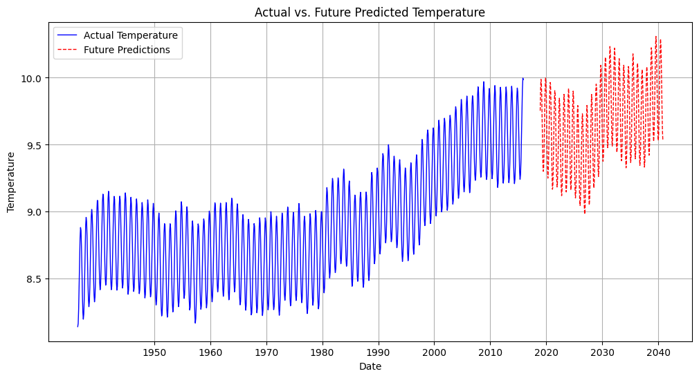
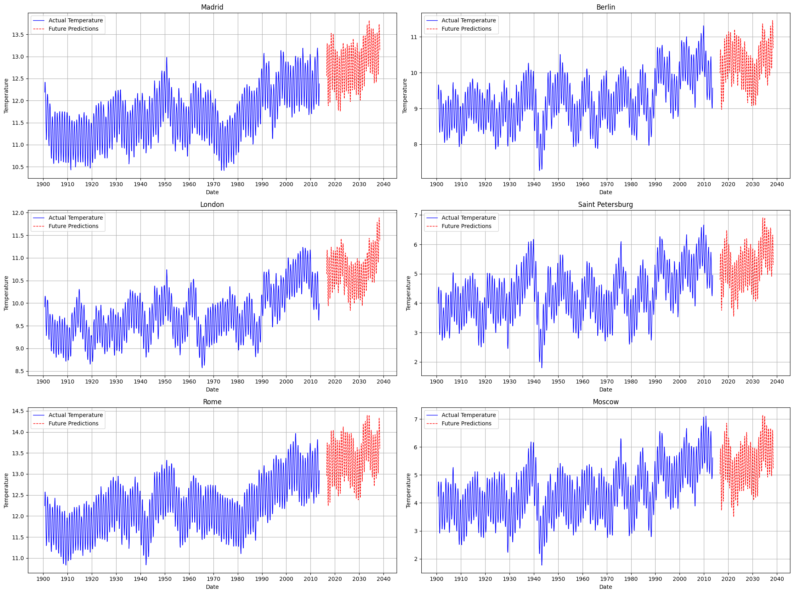
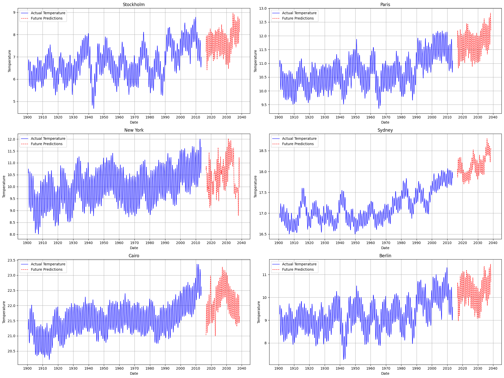
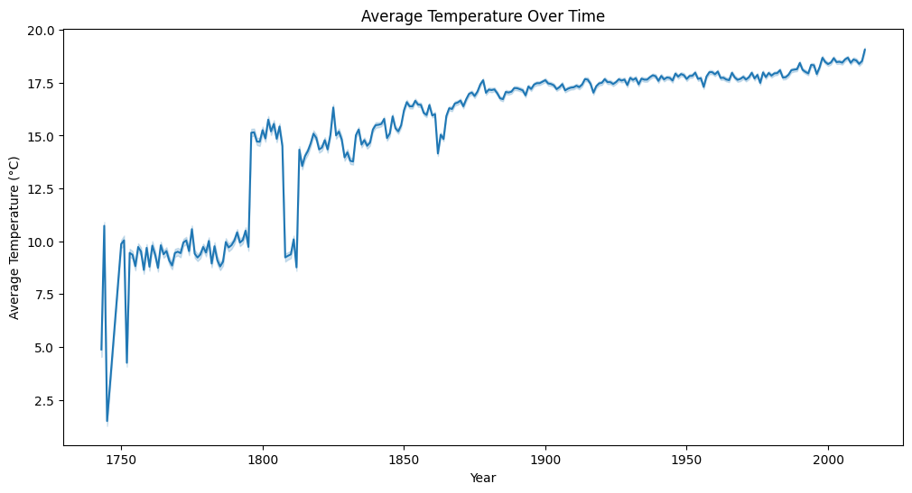
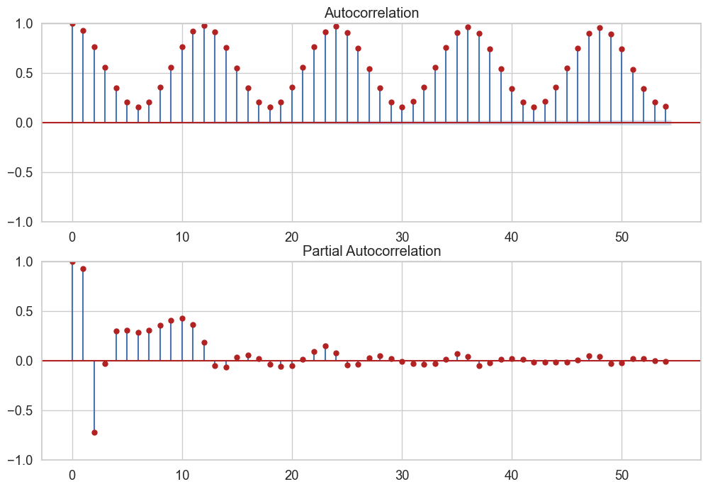
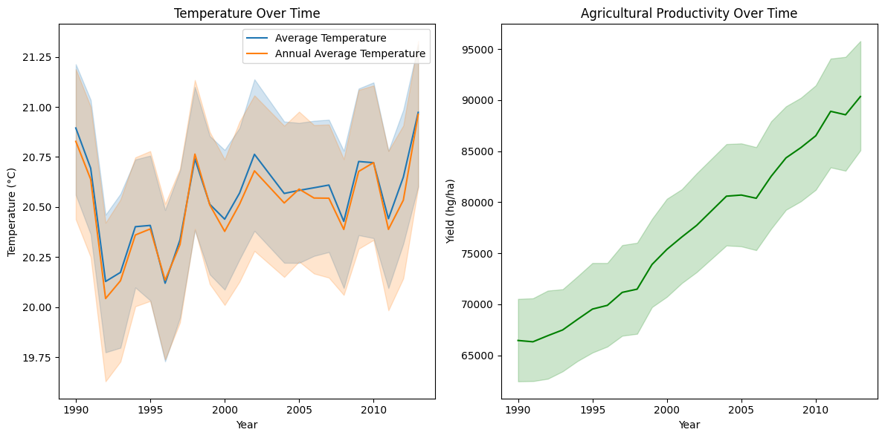

# Global Climate Change and Land Temperature Forecasting System (Time Series & LSTM)

## Overview

Global climate dynamics and rising surface temperatures present severe systemic risks to ecological equilibrium, urban infrastructure, and agricultural crop yields. Quantifying historical climate trajectories and forecasting future temperature shifts requires robust statistical time-series decomposition and non-linear deep sequence modeling.

This project implements an enterprise-scale climate analytics and temperature forecasting suite trained on multi-century global climate sensor records (from 1750 to modern era). The system combines automated geospatial cleaning, seasonal Autoregressive Integrated Moving Average (ARIMA) modeling, Deep Long Short-Term Memory (LSTM) recurrent networks, and agricultural yield correlation modeling, accompanied by high-resolution geospatial heatmaps.

---


---

## Problem Statement

Accelerating global climate change and land surface temperature volatility pose severe risks to planetary ecosystems, urban infrastructure, and global agricultural crop yields. Climate researchers and policymakers require predictive analytical frameworks capable of harmonizing multi-century longitudinal climate sensor data (from 1750 to present), isolating seasonal temperature cycles via statistical ARIMA decomposition, forecasting future regional temperature trajectories with Deep LSTM networks, and quantifying the direct empirical correlation between temperature shifts and national crop yields.

## Key Features

- Multi-Century Longitudinal Analysis: Harmonizes global climate sensor feeds from 1750 to present day.
- Statistical Time-Series Decomposition: ARIMA and Autocorrelation Function (ACF) seasonal modeling.
- Deep Recurrent Sequence Forecasting: Multi-layer LSTM networks forecasting planetary surface temperatures.
- Geospatial GIS Mapping & Agricultural Impact: Interactive Folium choropleths and crop yield sensitivity regressions.

## System Architecture and Workflow

```
[ Global Climate Sensor Repositories (Global, Country, State, Major City Logs) ]
 |
 v
[ Preprocessing, Anomaly Imputation & Geo-Spatial Normalization (cleaning.ipynb) ]
 |
 v
+-------------------------------------------------------------------------------+
| Multi-Paradigm Modeling Framework |
| |
| [ Statistical Time-Series ] [ Deep Sequence Forecasting ] |
| - ARIMA / SARIMA Modeling - Multi-Layer LSTM Recurrent Networks |
| - ACF / PACF Autocorrelation - Epoch Loss Convergence Modeling |
| |
| [ Geospatial Analytics ] [ Agricultural Impact Modeling ] |
| - GeoPandas Surface Maps - Temperature vs. Crop Yield ($R^2$ Scaling)|
+-------------------------------------------------------------------------------+
 |
 v
[ Interactive Web Visualizations (Folium / city_map.html) & Policy Reporting ]
```

---

## Geospatial and Climate Visualizations

### 1. Global Land Temperature Spatial Distribution


*Interpretation*: High-resolution GeoPandas choropleth map illustrating mean land surface temperature distributions across global sovereign territories, identifying thermal elevation in equatorial and sub-tropical regions.

### 2. Major Metropolitan City Climate Map


*Interpretation*: Geospatial coordinate mapping of historical temperature monitoring stations across major global industrial centers, tracking urban heat island anomalies.

### 3. Urban Temperature Distribution Map


*Interpretation*: Regional geospatial density mapping of thermal distribution across urban municipal centers.

### 4. Longitudinal Global Temperature Time Series Trajectory


*Interpretation*: Multi-century historical lineplot illustrating the sharp acceleration in average global land temperature beginning with the second industrial revolution (~1880 to present day).

### 5. Autocorrelation Function (ACF) Lag Structure


*Interpretation*: Autocorrelation analysis across lag intervals confirming strong annual seasonality and long-memory autoregressive properties in multi-year climate cycles.

### 6. Climate Shifts vs. Agricultural Crop Yields


*Interpretation*: Scatter plot and regression trendline modeling the non-linear relationship between mean temperature shifts and national crop yield productivity (`hg/ha_yield`).

---

## Technical Specifications

| Component | Framework / Library | Application Scope |
| :--- | :--- | :--- |
| **Data Processing** | Pandas, NumPy | Longitudinal time-series data aggregation |
| **Statistical Modeling** | Statsmodels (`statsmodels.tsa.arima`) | ARIMA seasonal trend decomposition |
| **Deep Learning** | TensorFlow / Keras | Multi-layer LSTM recurrent networks |
| **Geospatial Mapping** | GeoPandas, Folium, Matplotlib | Interactive GIS choropleth and coordinate maps |
| **Visualization** | Seaborn, Matplotlib | Multi-panel time-series and correlation plots |

---

## Project Structure

```
global-temperature-prediction/
├── FINAL/
│ ├── cleaning.ipynb # Data preprocessing and sensor harmonization
│ ├── prediction.ipynb # ARIMA and LSTM predictive modeling
│ ├── heatmaps.ipynb # Geospatial surface heatmaps
│ ├── heat_map.ipynb # Deep sequence LSTM training
│ ├── city_map.html # Interactive Folium web GIS map
│ ├── GlobalTemperatures.csv # Global aggregate temperature records
│ ├── GlobalLandTemperaturesByCountry.csv # Country-level longitudinal series
│ ├── GlobalLandTemperaturesByMajorCity.csv # Metropolitan climate series
│ ├── GlobalLandTemperaturesByState.csv # State-level territorial series
│ └── yield_df.csv # Agricultural crop yield metrics
├── plots/ # Generated maps and analytical figures
│ ├── global.png # Global land temperature choropleth
│ ├── major_city.png # Major city monitoring station map
│ ├── city.png # Urban climate density map
│ ├── plot_cell_14_1.png # Historical temperature trajectory
│ ├── plot_cell_72_13.png # Autocorrelation (ACF) plot
│ └── plot_cell_11_2.png # Crop yield correlation scatter plot
├── requirements.txt # Environment dependencies
└── README.md # System documentation
```

---

## Installation and Environment Setup

### 1. Clone Repository
```bash
git clone https://github.com/AbdulRehmanRattu/Global-Temperature-Prediction.git
cd Global-Temperature-Prediction
```

### 2. Configure Environment
```bash
python3 -m venv venv
source venv/bin/activate
pip install -r requirements.txt
```

### 3. Requirements Specification (`requirements.txt`)
```
pandas>=2.0.0
numpy>=1.23.0
scikit-learn>=1.3.0
statsmodels>=0.14.0
tensorflow>=2.12.0
geopandas>=0.13.0
folium>=0.14.0
matplotlib>=3.7.0
seaborn>=0.12.0
jupyter>=1.0.0
```

---

## Usage Guide

### 1. Run Data Cleaning & Feature Extraction
```bash
jupyter notebook FINAL/cleaning.ipynb
```

### 2. Execute Time-Series & Deep LSTM Modeling
```bash
jupyter notebook FINAL/prediction.ipynb
```

### 3. Generate Geospatial Visualizations
```bash
jupyter notebook FINAL/heatmaps.ipynb
```
Open `FINAL/city_map.html` in any web browser to explore the interactive geospatial GIS interface.
